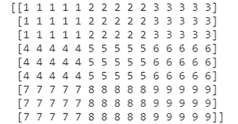
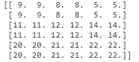

# 如何使用 Python 中的 NumPy 通过重复元素对矩阵进行上采样？

> 原文:[https://www . geeksforgeeks . org/如何使用 python 中的 numpy 对重复元素矩阵进行上采样/](https://www.geeksforgeeks.org/how-to-upsample-a-matrix-by-repeating-elements-using-numpy-in-python/)

**先决条件** : [Numpy](https://www.geeksforgeeks.org/python-numpy/)

对一个矩阵进行上采样仅仅意味着扩展它，显然上采样可以通过向原始矩阵添加更多元素来完成。可以通过添加新元素、扩展原矩阵等多种方式完成，也可以通过原矩阵本身的矩阵元素来完成。后面的方法将在下面讨论，同时讨论两种方法。

### 方法 1:使用 repeat()

我们使用 numpy.repeat()方法通过重复矩阵的数字来对矩阵进行上采样。我们在 repeat()方法中将矩阵与轴一起传递，以对矩阵进行上采样。此方法用于重复数组的元素。

> **语法:**
> 
> numpy.repeat(数组，重复，轴=0)
> 
> **参数:**
> 
> *   数组=数组的名称
> *   重复=每个元素的重复次数
> *   轴=沿其重复值的轴。默认情况下，轴设置为“无”。
> *   对于行方向的**轴=0** ，对于列方向的**轴=1** 。

**接近**

*   导入模块
*   创建数组
*   传递给重复方法
*   打印矩阵

**示例:**

## 蟒蛇 3

```
# importing required module
import numpy as np

# declaring an array
a = [[1, 2, 3], [4, 5, 6], [7, 8, 9]]

# use the repeat function to upsample the array
print(np.repeat(a, 5, axis=1).repeat(3, axis=0))
```

**输出:**



### 方法 2:

在这种方法中，我们将看到如何使用 **np.kron** 对矩阵进行上采样。我们将矩阵与一个 1 矩阵一起传递，这个 1 矩阵将使用 kron()方法相互相乘，结果将是一个上采样矩阵。

**语法:**

```
np.kron(a ,b)
```

其中 a 和 b 是两个数组。

*   它返回两个数组的 Kronecker 积。
*   它的参数是两个要计算乘积的数组

**示例:**

## 蟒蛇 3

```
# import required libraries
import numpy as np

# creating an array using numpy
a = np.array([[9, 8, 5], [11, 12, 14], [20, 21, 22]])

# using kron function upsampling the array
upsampled_array = np.kron(a, np.ones((2, 2)))

# printing the desired result
print(upsampled_array)
```

**输出:**

