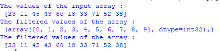

# Python 中多条件的 NumPy where()如何使用？

> 原文:[https://www . geeksforgeeks . org/如何使用-python 中的多条件 numpy-where/](https://www.geeksforgeeks.org/how-to-use-numpy-where-with-multiple-conditions-in-python/)

在 Python 中，NumPy 有许多库函数来创建数组，其中一个库函数是从另一个数组的满足条件中创建一个数组。[numpy . where()](https://www.geeksforgeeks.org/numpy-where-in-python/)函数返回满足给定条件的输入数组中元素的索引。

**语法:**

> *numpy.where(条件[，x，y])*
> 
> ***参数:***
> 
> *   ***条件:**为真时，收益率为 x，否则收益率为 y。*
> *   ***x，y :** 可供选择的数值。x、y 和条件需要可以扩展到某种形状。*
> 
> ***返回:**【数组或数组元组】如果同时指定了 x 和 y，则输出数组包含 x 的元素，其中条件为真，其他地方包含 y 的元素。*

如果给出了唯一的条件，则返回元组条件非零()，即条件为真的索引。在上面的语法中，我们可以看到 where()函数可以接受两个参数，其中一个是强制的，另一个是可选的。如果条件的值为真，将根据索引创建一个数组。

**例 1:**

Numpy where()与使用逻辑或的多个条件一起使用。

## 蟒蛇 3

```py
# Import NumPy library

import numpy as np

# Create an array using the list

np_arr1 = np.array([23, 11, 45, 43, 60, 18, 
                    33, 71, 52, 38])
print("The values of the input array :\n", np_arr1)

# Create another array based on the 
# multiple conditions and one array
new_arr1 = np.where((np_arr1))

# Print the new array
print("The filtered values of the array :\n", new_arr1)

# Create an array using range values
np_arr2 = np.arange(40, 50)

# Create another array based on the 
# multiple conditions and two arrays
new_arr2 = np.where((np_arr1), np_arr1, np_arr2)

# Print the new array
print("The filtered values of the array :\n", new_arr2)
```

输出:



**例 2:**

Numpy where()使用逻辑“与”与多个条件进行比较。

## 蟒蛇 3

```py
# Import NumPy library

import numpy as np

# Create two arrays of random values
np_arr1 = np.random.rand(10)*100
np_arr2 = np.random.rand(10)*100

# Print the array values
print("\nThe values of the first array :\n", np_arr1)
print("\nThe values of the second array :\n", np_arr2)

# Create a new array based on the conditions
new_arr = np.where((np_arr1), np_arr1, np_arr2)

# Print the new array
print("\nThe filtered values of both arrays :\n", new_arr)
```