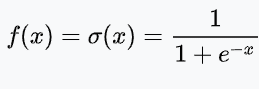
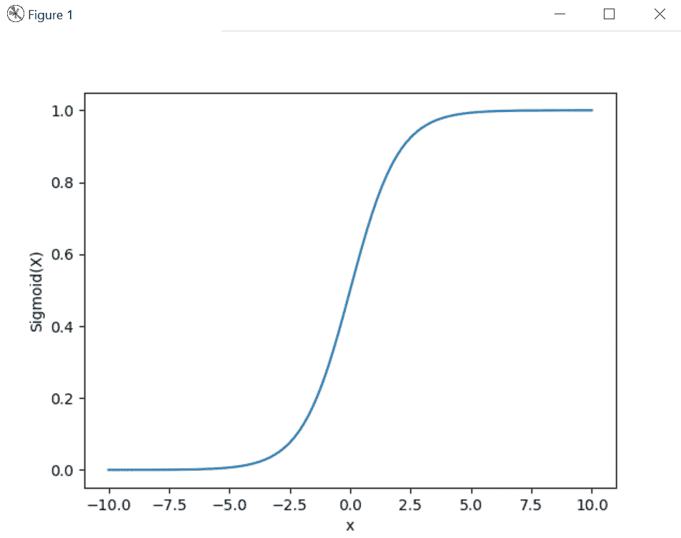
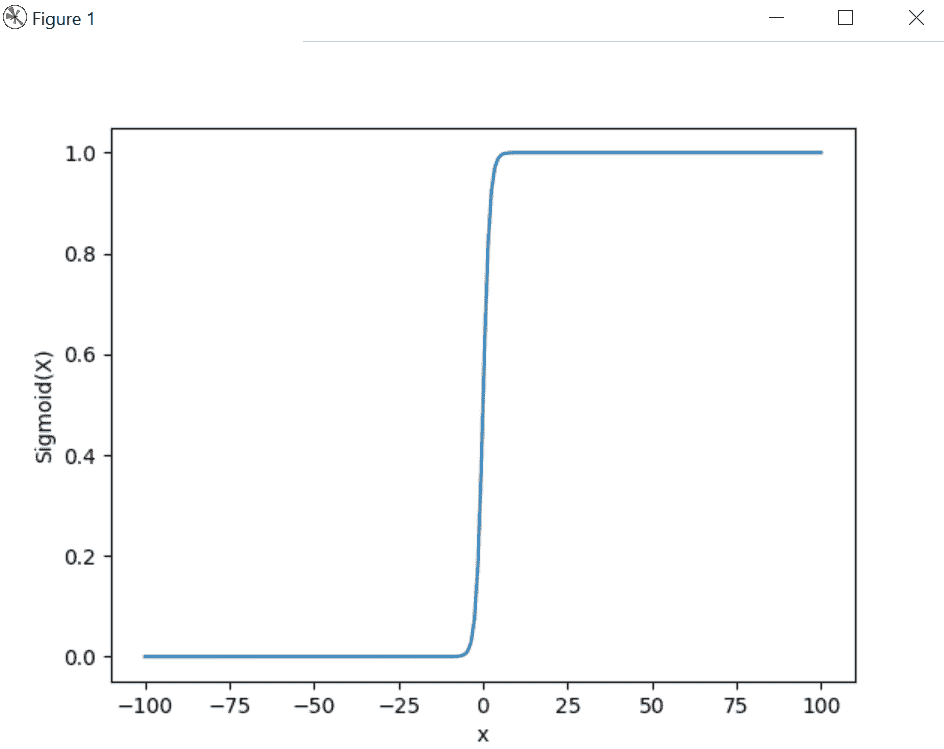

# 使用 Numpy

实现乙状结肠功能

> 原文:[https://www . geeksforgeeks . org/implement-sigmoid-function-use-numpy/](https://www.geeksforgeeks.org/implement-sigmoid-function-using-numpy/)

借助 **Sigmoid** 激活函数，我们能够减少训练时的损失，因为它在训练时消除了机器学习模型中的梯度问题。

> 

```
# Import matplotlib, numpy and math
import matplotlib.pyplot as plt
import numpy as np
import math

x = np.linspace(-10, 10, 100)
z = 1/(1 + np.exp(-x))

plt.plot(x, z)
plt.xlabel("x")
plt.ylabel("Sigmoid(X)")

plt.show()
```

**输出:**



**示例#1 :**

```
# Import matplotlib, numpy and math
import matplotlib.pyplot as plt
import numpy as np
import math

x = np.linspace(-100, 100, 200)
z = 1/(1 + np.exp(-x))

plt.plot(x, z)
plt.xlabel("x")
plt.ylabel("Sigmoid(X)")

plt.show()
```

**输出:**

