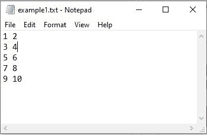
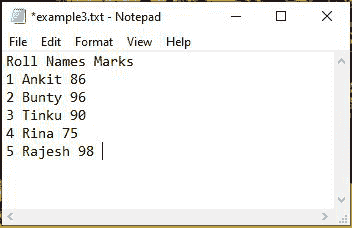
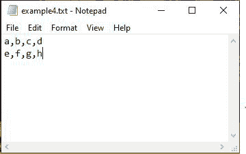

# 将文本文件导入 Numpy 数组

> 原文:[https://www . geesforgeks . org/import-text-files-in-numpy-arrays/](https://www.geeksforgeeks.org/import-text-files-into-numpy-arrays/)

Numpy 是“数字 Python”的缩写。它是 python 中的一个库，用于支持 n 维数组。但是你有没有想过把数据从文本文件加载到 NumPy 中。别担心，我们会在这篇文章中讨论同样的问题。要将文本文件导入 Numpy 数组，我们在 Numpy 中有两个功能:

1.  **numpy . load txt()**–用于加载文本文件数据
2.  **numpy . genfromtxt()**–用于从文本文件加载数据，缺失值按定义处理。

**注意:**当无数据缺失时，numpy.loadtxt()是 numpy.genfromtxt()的等价函数。

**方法 1:**[**numpy . loadtxt()**](https://www.geeksforgeeks.org/numpy-loadtxt-in-python/)

**语法:**

> numpy.loadtxt(fname，dtype = float，comments='# '，分隔符=None，转换器=None，skiprows=0，usecols=None，unpack=False，ndmin=0，编码='bytes '，max_rows=None，* like = None)

numpy.loadtxt()的默认数据类型(dtype)参数是 float。

**示例 1:** 将文本文件导入 Numpy 数组

本例中考虑了以下“example1.txt”文本文件。



## 蟒蛇 3

```py
import numpy as np

# Text file data converted to integer data type
File_data = np.loadtxt("example1.txt", dtype=int)
print(File_data)
```

**输出:**

```py
[[ 1  2]
[ 3  4]
[ 5  6]
[ 7  8]
[ 9 10]]
```

**示例 2:** 通过跳过第一行将文本文件导入 NumPy 数组


## 蟒蛇 3

```py
import numpy as np

# skipping first row
# converting file data to string
data = np.loadtxt("example2.txt", skiprows=1, dtype='str')
print(data)
```

**输出:**

```py
[['2' 'Bunty']
['3' 'Tinku']
['4' 'Rina']]
```

**示例 3:** 仅将文本文件的第一列(名称)导入 numpy 数组

NumPy 数组中的索引从 0 开始。因此，文本文件中的 Roll 列是 0 <sup>第</sup>列，Names 列是 1 <sup>第</sup>列，Marks 是文本文件“example3.txt”中的 2 <sup>第</sup>列。



## 蟒蛇 3

```py
import numpy as np

# only column1 data is imported into numpy
# array from text file
data = np.loadtxt("example3.txt", usecols=1, skiprows=1, dtype='str')

for each in data:
    print(each)
```

**输出:**

```py
Ankit
Bunty
Tinku
Rina
Rajesh
```

**方法二:numpy.genfromtxt】**

**语法:**

> numpy . genfroxt(fname，dtype=float，comments='# '，分隔符=None，skip_header=0，skip_footer=0，converters=None，missing_values=None，filling_values=None，usecols=None，names = None，excludelist=None，deletechars= "！#$%&'()*+, -./:;<=>？@[\\]^{|}~ "，replace_space='_ '，autostrip=False，区分大小写=True，defaultfmt='f%i '，unpack=None，usemask=False，loose = true，invalid_raise=True，max_rows=None，编码='bytes '，*，like=None)

除了 numpy.genfromtxt()中的 fname(文件名)之外，所有其他参数都是可选的。

**例 1:**



## 蟒蛇 3

```py
import numpy as np

Data = np.genfromtxt("example4.txt", dtype=str,
                     encoding=None, delimiter=",")
print(Data)
```

**输出:**

```py
[['a' 'b' 'c' 'd']
['e' 'f' 'g' 'h']]
```

**示例 2:** 通过跳过最后一行将文本文件导入 numpy 数组


## 蟒蛇 3

```py
import numpy as np

# skipping last line in the file
Data = np.genfromtxt("example5.txt", dtype=str,
                     encoding=None, skip_footer=1)
print(Data)
```

**输出:**

```py
[['This' 'is' 'GeeksForGeeks' 'Website']
['How' 'are' 'You' 'Geeks?']
['Geeks' 'for' 'Geeks' 'GFG']]
```