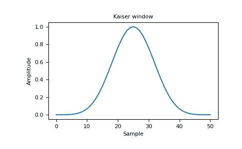
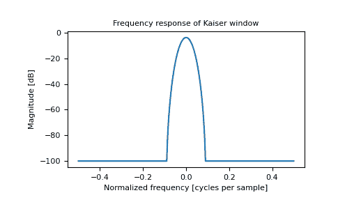

# 皇帝在 num py–python

> 原文:[https://www.geeksforgeeks.org/kaiser-in-numpy-python/](https://www.geeksforgeeks.org/kaiser-in-numpy-python/)

**凯泽窗**是利用贝塞尔函数形成的锥度。

> **语法:** numpy.kaiser(M，beta)
> 
> **参数:**
> **M:**【int】输出窗口的点数。如果为零或更小，则返回一个空数组。
> **beta :** 【浮动】窗口的形状参数。
> 
> **返回:**
> **出:**【数组】窗口，最大值归一化为 1(值 1 只在样本数为奇数时出现)。

**示例:**

```
import numpy as np 

print(np.kaiser(12, 14)) 
```

**输出:**

```
[  7.72686684e-06   3.46009194e-03   4.65200189e-02   2.29737120e-01
   5.99885316e-01   9.45674898e-01   9.45674898e-01   5.99885316e-01
   2.29737120e-01   4.65200189e-02   3.46009194e-03   7.72686684e-06]

```

## 绘制窗口及其频率响应–

**对于窗口:**

```
import numpy as np 
import matplotlib.pyplot as plt 
from numpy.fft import fft, fftshift 

window = np.kaiser(51, 14)

plt.plot(window) 
plt.title("Kaiser window")
plt.ylabel("Amplitude") 
plt.xlabel("Sample") 
plt.show() 
```

**输出:**


**频率:**

```
import numpy as np 
import matplotlib.pyplot as plt 
from numpy.fft import fft, fftshift 

window = np.kaiser(51, 14)
plt.figure() 

A = fft(window, 2048) / 25.5
mag = np.abs(fftshift(A)) 
freq = np.linspace(-0.5, 0.5, len(A)) 
response = 20 * np.log10(mag) 
response = np.clip(response, -100, 100) 

plt.plot(freq, response) 
plt.title("Frequency response of Kaiser window") 
plt.ylabel("Magnitude [dB]") 
plt.xlabel("Normalized frequency [cycles per sample]") 
plt.axis("tight") 
plt.show() 
```

**输出:**
