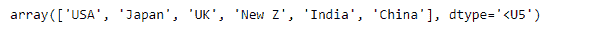
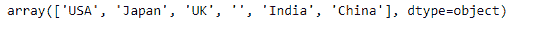
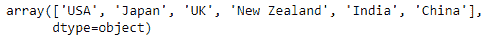
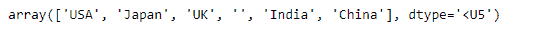
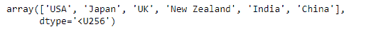

# 修改 Numpy 数组存储任意长度的字符串

> 原文:[https://www . geesforgeks . org/modify-numpy-array-to-store-一个任意长度的字符串/](https://www.geeksforgeeks.org/modify-numpy-array-to-store-an-arbitrary-length-string/)

NumPy 建立在成功的数值数组对象之上(并且是其后继对象)。它的目标是为科学计算创造一个有用的环境。NumPy 提供了两个基本对象:一个 N 维数组对象(ndarray)和一个通用函数对象(ufunc)。

包含字符串值的任何 numpy 数组的数据类型是数组中任何字符串的最大长度。一旦设置，它将只能存储长度不超过创建时最大长度的新字符串。如果我们试图重新分配另一个长度大于现有元素最大长度的字符串值，它会丢弃超过最大长度的所有值。

在这篇文章中，我们将讨论克服这个问题的方法，并创建一个任意长度的 numpy 数组*。*

*让我们首先想象一下创建任意长度的字符串类型 numpy 数组的问题。*

```py
*# importing numpy as np
import numpy as np

# Create the numpy array
country = np.array(['USA', 'Japan', 'UK', '', 'India', 'China'])

# Print the array
print(country)*
```

***输出:**
*

*正如我们在输出中看到的，给定数组中任何字符串长度元素的最大长度是 5。让我们尝试在数组中缺少值的地方分配一个长度更长的值。*

```py
*# Assign 'New Zealand' at the place of missing value
country[country == ''] = 'New Zealand'

# Print the modified array
print(country)*
```

***输出:**
*

*正如我们在输出中看到的，由于长度的限制，分配了“新 Z”而不是“新西兰”。现在，让我们看看如何克服这个问题。*

***问题#1 :** 创建任意长度的 numpy 数组。*

***解决方案:**创建数组时，为其分配“对象”数据类型。这让您拥有 python 字符串的所有行为。*

```py
*# importing the numpy library as np
import numpy as np

# Create a numpy array
# set the dtype to object
country = np.array(['USA', 'Japan', 'UK', '', 'India', 'China'], dtype = 'object')

# Print the array
print(country)*
```

***输出:***

**

*现在，我们将在给定数组中缺少值的地方指定一个任意长度的值。*

```py
*# Assign 'New Zealand' to the missing value
country[country == ''] = 'New Zealand'

# Print the array
print(country)*
```

***输出:***

**

*正如我们在输出中看到的，我们已经成功地为给定的数组对象分配了一个任意长度的字符串。*

***问题 2 :** 创建任意长度的 numpy 数组。*

***解决方案:**我们将使用`numpy.astype()`函数来更改给定数组对象的数据类型。*

```py
*# importing the numpy library as np
import numpy as np

# Create a numpy array
# Notice we have not set the dtype of the object
# this will lead to the length problem 
country = np.array(['USA', 'Japan', 'UK', '', 'India', 'China'])

# Print the array
print(country)*
```

***输出:***

**

*现在我们将使用`numpy.astype()`函数改变给定数组对象的数据类型。然后我们会给它分配一个任意长度的字符串。*

```py
*# Change the dtype of the country
# object to 'U256'
country = country.astype('U256')

# Assign 'New Zealand' to the missing value
country[country == ''] = 'New Zealand'

# Print the array
print(country)*
```

***输出:***

**

*正如我们在输出中看到的，我们已经成功地为给定的数组对象分配了一个任意长度的字符串。*

***注意:**在这种情况下，我们在更改数据类型后可以分配的最大字符串长度是 256。*