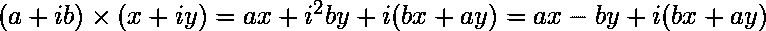

# 使用 Python 中的 NumPy 乘法复数矩阵

> 原文:[https://www . geeksforgeeks . org/复数乘法矩阵-使用 python 中的 numpy/](https://www.geeksforgeeks.org/multiply-matrices-of-complex-numbers-using-numpy-in-python/)

在本文中，我们将讨论如何使用 [NumPy](https://www.geeksforgeeks.org/python-numpy/) 相乘两个包含复数的矩阵，但是首先，让我们知道什么是复数。A [复数](https://www.geeksforgeeks.org/complex-numbers-in-python-set-1-introduction/)是可以用 **x+yj** 形式表示的任意数，其中 x 为实部，y 为虚部。[两个复数的乘法](https://www.geeksforgeeks.org/multiplication-two-complex-numbers-given-strings/)可以使用以下公式完成–



NumPy 提供了返回向量 a 和 b 的点积的 [vdot()](https://www.geeksforgeeks.org/numpy-vdot-python/) 方法。该函数处理复数的方式不同于点( *a* 、 *b* )。

**语法:**

```
numpy.vdot(vector_a, vector_b)
```

**例 1:**

## 蟒蛇 3

```
# importing numpy as library
import numpy as np

# creating matrix of complex number
x = np.array([2+3j, 4+5j])
print("Printing First matrix:")
print(x)

y = np.array([8+7j, 5+6j])
print("Printing Second matrix:")
print(y)

# vector dot product of two matrices
z = np.vdot(x, y)
print("Product of first and second matrices are:")
print(z)
```

**输出:**

```
Printing First matrix:
[2.+3.j 4.+5.j]
Printing Second matrix:
[8.+7.j 5.+6.j]
Product of first and second matrices are:
(87-11j)

```

**例 2:** 现在假设我们有 2D 矩阵:

## 蟒蛇 3

```
# importing numpy as library
import numpy as np

# creating matrix of complex number
x = np.array([[2+3j, 4+5j], [4+5j, 6+7j]])
print("Printing First matrix:")
print(x)

y = np.array([[8+7j, 5+6j], [9+10j, 1+2j]])
print("Printing Second matrix:")
print(y)

# vector dot product of two matrices
z = np.vdot(x, y)
print("Product of first and second matrices are:")
print(z)
```

**输出:**

```
Printing First matrix:
[[2.+3.j 4.+5.j]
 [4.+5.j 6.+7.j]]
Printing Second matrix:
[[8\. +7.j 5\. +6.j]
 [9.+10.j 1\. +2.j]]
Product of first and second matrices are:
(193-11j)

```