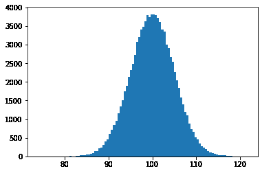
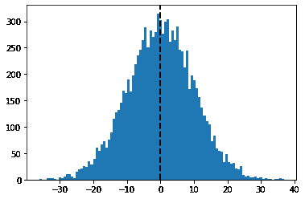

# 使用 Numpy 和 Matplotlib 的正态分布图

> 原文:[https://www . geeksforgeeks . org/normal-distribution-plot-use-numpy-and-matplotlib/](https://www.geeksforgeeks.org/normal-distribution-plot-using-numpy-and-matplotlib/)

在本文中，我们将看到如何使用 *numpy* 和 *matplotlib* 模块在 python 中创建正态分布图。

## 什么是正态分布？

**正态分布**是统计学中使用的概率函数，讲述数据值是如何分布的。它是统计学中最重要的概率分布函数，因为它在实际场景中具有优势。比如人口的身高，鞋码，智商水平，擀一个模具，等等很多。

一般观察到，当从独立来源随机收集数据时，数据分布是正常的。在绘制 x 轴上的变量值和 y 轴上的值的计数之后产生的图形是钟形曲线图。该图表示峰值点是数据集的平均值，并且数据集的一半值位于平均值的左侧，另一半位于平均值的右侧，表示值的分布。图是对称分布。

### 需要的模块

**Numpy** 是一个通用的数组处理包。它提供了一个高性能的多维数组对象，以及使用这些数组的工具。它是使用 Python 进行科学计算的基本包。
除了有明显的科学用途外， *Numpy* 还可以作为通用数据的高效多维容器。

**Matplotlib** 是一个用 Python 创建静态、动画和交互式可视化的绘图库。 *Matplotlib* 可以用在 Python 脚本、Python 和 IPython shell、web 应用服务器以及各种图形用户界面工具包中，如 *Tkinter、awxPython* 等。

**下面是一些使用 Numpy 和 Matplotlib 模块创建正态分布图的程序:**

**例 1:**

## 蟒蛇 3

```
# importing numpy as np
import numpy as np

# importing pyplot as plt
import matplotlib.pyplot as plt

# position
pos = 100
# scale
scale = 5

# size
size = 100000

# creating a normal distribution data
values = np.random.normal(pos, scale, size)

# plotting histograph
plt.hist(values, 100)

# showing the graph
plt.show()
```

**输出:**



**例 2:**

## 蟒蛇 3

```
# importing numpy as np
import numpy as np

# importing pyplot as plt
import matplotlib.pyplot as plt

# position
pos = 0

# scale
scale = 10

# size
size = 10000

# random seed
np.random.seed(10)

# creating a normal distribution data
values = np.random.normal(pos, scale, size)

# plotting histograph
plt.hist(values, 100)

# plotting mean line
plt.axvline(values.mean(), color='k', linestyle='dashed', linewidth=2)

# showing the plot
plt.show()
```

**输出:**

