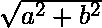
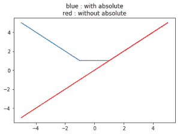

# Python 中的 numpy.absolute()

> 原文:[https://www.geeksforgeeks.org/numpy-absolute-python/](https://www.geeksforgeeks.org/numpy-absolute-python/)

**numpy.absolute(arr，out = None，ufunc 'absolute') :** 这个数学函数帮助用户计算每个元素的绝对值。对于复杂输入，a + ib，绝对值为。

**参数:**

```
arr  : *[array_like]* Input array or object whose elements, we need to test.

```

**返回:**

```
An array with absolute value of each array.  

```

**代码#1:工作**

```
# Python program explaining
# absolute () function

import numpy as np

arr1 = [1, -3, 15, -466]
print ("Absolute Value of arr1 : \n",
                    np.absolute(arr1))

arr2 = [23 , -56]
print ("\nAbsolute Value of arr2 : \n",
                        np.absolute(arr2))
```

**输出:**

```
Absolute Value of arr1 : 
 [  1   3  15 466]

Absolute Value of arr2 : 
 [23 56]

```

**代码#2:处理复数**

```
# Python program explaining
# absolute () function

import numpy as np

a = 4 + 3j
print("Absolute(4 + 3j) : ",
             np.absolute(a))

b = 16 + 13j
print("\nAbsolute value(16 + 13j) : ",
                        np.absolute(b))
```

**输出:**

```
Absolute(4 + 3j) :  5.0

Absolute value(16 + 13j) :  20.6155281281
```

**代码# 3:numpy . absolute()**的图形表示

```
# Python program explaining
# absolute () function

import numpy as np
import matplotlib.pyplot as plt

a = np.linspace(start = -5, stop = 5,
                num = 6, endpoint = True)

print("Graphical Representation : \n",
                        np.absolute(a))

plt.title("blue : with absolute\nred : without absolute")
plt.plot(a, np.absolute(a))

plt.plot(a, a, color = 'red')
plt.show()
```

**输出:**

```
Graphical Representation : 
 [ 5\.  3\.  1\.  1\.  3\.  5.]

```


**参考文献:**
[https://docs . scipy . org/doc/numpy-1 . 13 . 0/reference/generated/numpy . absolute . html](https://docs.scipy.org/doc/numpy-1.13.0/reference/generated/numpy.absolute.html)
。