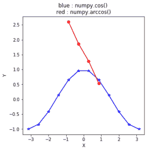

# python 中的 numpy.arccos()

> 哎哎哎:# t0]https://www . geeksforgeeks . org/num py-arccos-python/

**numpy.arccos(x[，out]) = ufunc 'arccos') :** 这个数学函数帮助用户计算所有 x(作为数组元素)的反 cos。

**参数:**

```py
array    : [array_like]elements are in radians.
out      : [array_like]array of same shape as x.

```

> **注:**
> 
> 2pi 弧度= 360 度
> 惯例是返回实部位于[0，pi]的角度 z。

**返回:**

```py
An array with inverse cosine of x 
for all x i.e. array elements. 

The values are in the closed interval [-pi/2, pi/2].

```

**代码#1:工作**

```py
# Python program explaining
# arccos() function

import numpy as np

in_array = [0, 1, 0.3, -1]
print ("Input array : \n", in_array)

arccos_Values = np.arccos(in_array)
print ("\nInverse Cosine values : \n", arccos_Values)
```

**输出:**

```py
Input array : 
 [0, 1, 0.3, -1]

Inverse Cosine values : 
 [ 1.57079633  0\.          1.26610367  3.14159265]
```

**代码#2:图形表示**

```py
# Python program showing
# Graphical representation  
# of arccos() function

import numpy as np
import matplotlib.pyplot as plt

in_array = np.linspace(-np.pi, np.pi, 12)
out_array1 = np.cos(in_array)
out_array2 = np.arccos(in_array)

print("in_array : ", in_array)
print("\nout_array with cos : ", out_array1)
print("\nout_arraywith arccos : ", out_array1)

# red for numpy.arccos()
plt.plot(in_array, out_array1,
            color = 'blue', marker = "*")

plt.plot(in_array, out_array2,
            color = 'red', marker = "o")

plt.title("blue : numpy.cos() \nred : numpy.arccos()")
plt.xlabel("X")
plt.ylabel("Y")
plt.show()
```

**输出:**

```py

in_array :  [-3.14159265 -2.57039399 -1.99919533 -1.42799666 -0.856798   -0.28559933
  0.28559933  0.856798    1.42799666  1.99919533  2.57039399  3.14159265]

out_array with cos :  [-1\.         -0.84125353 -0.41541501  0.14231484  0.65486073  0.95949297
  0.95949297  0.65486073  0.14231484 -0.41541501 -0.84125353 -1\.        ]

out_arraywith arccos :  [-1\.         -0.84125353 -0.41541501  0.14231484  0.65486073  0.95949297
  0.95949297  0.65486073  0.14231484 -0.41541501 -0.84125353 -1\.        ]
RuntimeWarning: invalid value encountered in arccos
  out_array1 = np.sin(in_array)
```


**参考文献:**
[https://docs . scipy . org/doc/numpy-dev/reference/generated/numpy . arcsin . html # numpy . arccos](https://docs.scipy.org/doc/numpy-dev/reference/generated/numpy.arcsin.html#numpy.arccos)
。