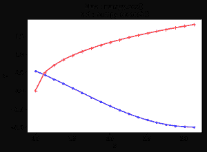

# numpy.arccosh()在 Python

中

> 原文:[https://www.geeksforgeeks.org/numpy-arccosh-in-python/](https://www.geeksforgeeks.org/numpy-arccosh-in-python/)

**numpy.arccosh() :** 这个数学函数帮助用户计算所有 arr 的反双曲余弦。

**语法:**

> **numpy.arccosh(arr，/，out=None，*，其中=True，
> casting='same_kind '，order='K '，dtype=None，ufunc 'arccosh')**
> 
> **参数:**
> 
> **arr :** 数组类
> 输入数组。
> **出:**【标准，可选】存储结果的位置。
> - >如果提供，它必须具有输入广播到的形状。
> - >如果未提供或无，则返回新分配的阵列。
> **其中:** array_like，可选
> True 值表示计算该位置的 ufunc，False 值表示将该值单独留在输出中。
> ****kwargs :** 允许将关键字可变长度的参数传递给函数。当我们想要处理函数中的命名参数时使用。
> 
> **返回:**一个 arr 的反双曲余弦值为
> 的数组，用于所有 arr，即数组元素。
> 
> **注:**
> 
> 2pi 弧度= 360 度
> 惯例是返回 arr 的角度，其虚部在[-pi，pi]中，实部在[0，inf]中。

**代码#1:工作**

```py
# Python program explaining
# arccosh() function

import numpy as np

in_array = [2, 1, 10, 100]
print ("Input array : \n", in_array)

arccosh_Values = np.arccosh(in_array)
print ("\nInverse hyperbolic Cosine values : \n", arccosh_Values)
```

**输出:**

```py
Input array : 
 [2, 1, 10, 100]

Inverse hyperbolic Cosine values : 
 [ 1.3169579   0\.          2.99322285  5.29829237]
```

**代码#2:图形表示**

```py
# Python program showing
# Graphical representation  
# of arccosh() function
%matplotlib inline 
import numpy as np
import matplotlib.pyplot as plt
in_array = np.linspace(1, np.pi, 18)
out_array1 = np.cos(in_array)
out_array2 = np.arccosh(in_array)

print("in_array : ", in_array)
print("\nout_array with cos : ", out_array1)
print("\nout_array with arccosh : ", out_array2)
#blue for numpy.cosh() 
# red for numpy.arccosh()
plt.plot(in_array, out_array1,
            color = 'blue', marker = ".")

plt.plot(in_array, out_array2,
            color = 'red', marker = "+")

plt.title("blue : numpy.cos() \nred : numpy.arccosh()")
plt.xlabel("X")
plt.ylabel("Y")
```

**输出:**

```py

in_array :  [ 1\.          1.12597604  1.25195208  1.37792812  1.50390415  1.62988019
  1.75585623  1.88183227  2.00780831  2.13378435  2.25976038  2.38573642
  2.51171246  2.6376885   2.76366454  2.88964058  3.01561662  3.14159265]

out_array with cos :  [ 0.54030231  0.43029566  0.31346927  0.19167471  0.0668423  -0.0590495
 -0.18400541 -0.30604504 -0.42323415 -0.53371544 -0.63573787 -0.72768451
 -0.80809809 -0.87570413 -0.92943115 -0.96842762 -0.99207551 -1\.        ]

out_array with arccosh :  [ 0\.          0.49682282  0.69574433  0.84411504  0.96590748  1.07053332
  1.16287802  1.24587516  1.32145434  1.39096696  1.45540398  1.51551804
  1.57189678  1.62500948  1.67523791  1.7228975   1.76825238  1.81152627]
```

)