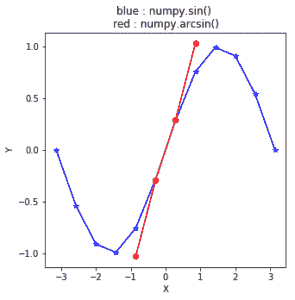

# python 中的 numpy.arcsin()

> 哎哎哎:# t0]https://www . geeksforgeeks . org/num py-arcsin-python/

**numpy.arcsin(x[，out]) = ufunc 'arcsin') :** 此数学函数帮助用户计算所有 x(作为数组元素)的逆正弦。

**参数:**

```py
array  : [array_like]elements are in radians.
out    : [array_like]array of same shape as x.

```

**返回:**

```py
An array with inverse sine of x
for all x i.e. array elements. 

The values are in the closed interval [-pi/2, pi/2].

```

**代码#1:工作**

```py
# Python program explaining
# arcsin() function

import numpy as np

in_array = [0, 1, 0.3, -1]
print ("Input array : \n", in_array)

arcsin_Values = np.arcsin(in_array)
print ("\nInverse Sine values : \n", arcsin_Values)
```

**输出:**

```py
Input array : 
 [0, 1, 0.3, -1]

Inverse Sine values : 
 [ 0\.          1.57079633  0.30469265 -1.57079633]
```

**代码#2:图形表示**

```py
# Python program showing
# Graphical representation of 
# arcsin() function

import numpy as np
import matplotlib.pyplot as plt

in_array = np.linspace(-np.pi, np.pi, 12)
out_array1 = np.sin(in_array)
out_array2 = np.arcsin(in_array)

print("in_array : ", in_array)
print("\nout_array with sin : ", out_array1)
print("\nout_arraywith arcsin : ", out_array1)

# red for numpy.arcsin()
plt.plot(in_array, out_array1,
            color = 'blue', marker = "*")

plt.plot(in_array, out_array2,
            color = 'red', marker = "o")

plt.title("blue : numpy.sin() \nred : numpy.arcsin()")
plt.xlabel("X")
plt.ylabel("Y")
plt.show()
```

**输出:**

```py

in_array :  [-3.14159265 -2.57039399 -1.99919533 -1.42799666 -0.856798   -0.28559933
  0.28559933  0.856798    1.42799666  1.99919533  2.57039399  3.14159265]

out_array with sin :  [ -1.22464680e-16  -5.40640817e-01  -9.09631995e-01  -9.89821442e-01
  -7.55749574e-01  -2.81732557e-01   2.81732557e-01   7.55749574e-01
   9.89821442e-01   9.09631995e-01   5.40640817e-01   1.22464680e-16]

out_arraywith arcsin :  [ -1.22464680e-16  -5.40640817e-01  -9.09631995e-01  -9.89821442e-01
  -7.55749574e-01  -2.81732557e-01   2.81732557e-01   7.55749574e-01
   9.89821442e-01   9.09631995e-01   5.40640817e-01   1.22464680e-16]
RuntimeWarning: invalid value encountered in arcsin
  out_array2 = np.arcsin(in_array)
```


**参考文献:**
[https://docs . scipy . org/doc/numpy-dev/reference/generated/numpy . arcsin . html # numpy . arcsin](https://docs.scipy.org/doc/numpy-dev/reference/generated/numpy.arcsin.html#numpy.arcsin)
。