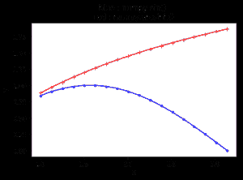

# numpy.arcsinh()在 Python

中

> 哎哎哎:# t0]https://www . geeksforgeeks . org/num py-arcsinh-in-python/

**numpy.arcsinh() :** 该数学函数帮助用户计算所有 arr 的反双曲正弦，按元素计算。

> **语法:** **numpy.arcsinh(arr，/，out=None，*，其中=True，casting='same_kind '，order='K '，dtype=None，ufunc ' arcsinh ')**
> T5】参数:
> 
> **arr :** 数组类
> 输入数组。
> **出:**【标准，可选】存储结果的位置。
> - >如果提供，它必须具有输入广播到的形状。
> - >如果未提供或无，则返回新分配的阵列。
> **其中:** array_like，可选
> True 值表示计算该位置的 ufunc，False 值表示将该值单独留在输出中。
> ****kwargs :** 允许将关键字可变长度的参数传递给函数。当我们想要处理函数中的命名参数时使用。
> 
> **返回:**一个 arr 的反双曲正弦值为
> 的数组，用于所有 arr，即数组元素。
> 
> **注:**
> 
> 2pi 弧度= 360 度
> 惯例是返回虚部位于[-pi/2，pi/2]的 arr 角。

**代码#1:工作**

```
# Python program explaining
# arcsinh() function

import numpy as np

in_array = [2, 1, 10, 100]
print ("Input array : \n", in_array)

arcsinh_Values = np.arcsinh(in_array)
print ("\nInverse hyperbolic sine values of input array : \n", arcsinh_Values)
```

**输出:**

```
Input array : 
 [2, 1, 10, 100]

Inverse hyperbolic sine values of input array : 
 [ 1.44363548  0.88137359  2.99822295  5.29834237]
```

**代码#2:图形表示**

```
# Python program showing
# Graphical representation  
# of arcsinh() function % matplotlib inline 
import numpy as np
import matplotlib.pyplot as plt
in_array = np.linspace(1, np.pi, 18)
out_array1 = np.sin(in_array)
out_array2 = np.arcsinh(in_array)

print("in_array : ", in_array)
print("\nout_array with sin : ", out_array1)
print("\nout_array with arcsinh : ", out_array2)
# blue for numpy.sinh() 
# red for numpy.arcsinh()
plt.plot(in_array, out_array1,
            color = 'blue', marker = ".")

plt.plot(in_array, out_array2,
            color = 'red', marker = "+")

plt.title("blue : numpy.sin() \nred : numpy.arcsinh()")
plt.xlabel("X")
plt.ylabel("Y")
```

**输出:**

```

in_array :  [ 1\.          1.12597604  1.25195208  1.37792812  1.50390415  1.62988019
  1.75585623  1.88183227  2.00780831  2.13378435  2.25976038  2.38573642
  2.51171246  2.6376885   2.76366454  2.88964058  3.01561662  3.14159265]

out_array with sin :  [  8.41470985e-01   9.02688009e-01   9.49598344e-01   9.81458509e-01
   9.97763553e-01   9.98255056e-01   9.82925230e-01   9.52017036e-01
   9.06020338e-01   8.45664137e-01   7.71905017e-01   6.85911986e-01
   5.89047946e-01   4.82848093e-01   3.68995589e-01   2.49294878e-01
   1.25643097e-01   1.22464680e-16]

out_array with arcsinh :  [ 0.88137359  0.96770792  1.04881189  1.12508571  1.1969269   1.26471422
  1.32879961  1.38950499  1.44712201  1.50191335  1.55411486  1.60393799
  1.65157228  1.69718777  1.74093713  1.78295772  1.82337333  1.86229574]

```

