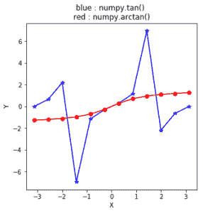

# numpy.arctan()在 Python

中

> 哎哎哎:# t0]https://www . geeksforgeeks . org/num py-arctan-python/

**numpy.arctan(x[，out]) = ufunc 'arctan') :** 这个数学函数帮助用户计算所有 x(作为数组元素)的反正切。

**参数:**

```
array : [array_like]elements are in radians.
out   : [array_like]array of same shape as x.

```

> **注:**
> 
> 2pi 弧度= 360 度
> 惯例是返回实部位于[-pi/2，pi/2]的角度 z。

**返回:**

```
An array with inverse tangent of x
for all x i.e. array elements. 

The values are in the closed interval [-pi/2, pi/2].

```

**代码#1:工作**

```
# Python program explaining
# arctan() function

import numpy as np

in_array = [0, 1, 0.3, -1]
print ("Input array : \n", in_array)

arctan_Values = np.arctan(in_array)
print ("\nInverse Tangent values : \n",
                            arctan_Values)
```

**输出:**

```
Input array : 
 [0, 1, 0.3, -1]

Inverse Tangent values : 
 [ 0\.          0.78539816  0.29145679 -0.78539816]
```

**代码#2:图形表示**

```
# Python program showing
# Graphical representation  
# of arctan() function

import numpy as np
import matplotlib.pyplot as plt

in_array = np.linspace(-np.pi, np.pi, 12)
out_array1 = np.tan(in_array)
out_array2 = np.arctan(in_array)

print("in_array : ", in_array)
print("\nout_array with tan : ", out_array1)
print("\nout_arraywith arctan : ", out_array1)

# red for numpy.arccos()
plt.plot(in_array, out_array1,
            color = 'blue', marker = "*")

plt.plot(in_array, out_array2,
            color = 'red', marker = "o")

plt.title("blue : numpy.tan() \nred : numpy.arctan()")
plt.xlabel("X")
plt.ylabel("Y")
plt.show()
```

**输出:**

```
in_array :  [-3.14159265 -2.57039399 -1.99919533 -1.42799666 -0.856798   -0.28559933
  0.28559933  0.856798    1.42799666  1.99919533  2.57039399  3.14159265]

out_array with tan :  [  1.22464680e-16   6.42660977e-01   2.18969456e+00  -6.95515277e+00
  -1.15406152e+00  -2.93626493e-01   2.93626493e-01   1.15406152e+00
   6.95515277e+00  -2.18969456e+00  -6.42660977e-01  -1.22464680e-16]

out_arraywith arctan :  [  1.22464680e-16   6.42660977e-01   2.18969456e+00  -6.95515277e+00
  -1.15406152e+00  -2.93626493e-01   2.93626493e-01   1.15406152e+00
   6.95515277e+00  -2.18969456e+00  -6.42660977e-01  -1.22464680e-16]
```


**参考文献:**
[https://docs . scipy . org/doc/numpy-dev/reference/generated/numpy . arcsin . html # numpy . arccos](https://docs.scipy.org/doc/numpy-dev/reference/generated/numpy.arcsin.html#numpy.arccos)
。