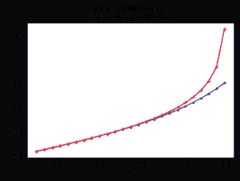

# python 中的 num py . arctanh()

> 哎哎哎:# t0]https://www . geeksforgeeks . org/num py-arctanh-in-python/

**numpy.arctanh() :** 这个数学函数帮助用户计算所有 arr 的反双曲正切，按元素计算。

> **语法:** **numpy.arctanh(arr，/，out=None，*，其中=True，casting='same_kind '，order='K '，dtype=None，ufunc ' arctanh ')**
> T5】参数:
> 
> **arr :** 数组类
> 输入数组。
> **出:**【标准，可选】存储结果的位置。
> - >如果提供，它必须具有输入广播到的形状。
> - >如果未提供或无，则返回新分配的阵列。
> **其中:** array_like，可选
> True 值表示计算该位置的 ufunc，False 值表示将该值单独留在输出中。
> ****kwargs :** 允许将关键字可变长度的参数传递给函数。当我们想要处理函数中的命名参数时使用。
> 
> **返回:**一个数组，所有 arr(即数组元素)的反双曲正切值为 arr
> 。
> 
> **注:**
> 
> 2pi 弧度= 360 度
> 惯例是返回虚部位于[-pi/2，pi/2]的 arr 角。

**代码#1:工作**

```
# Python program explaining
# arctanh() function

import numpy as np

in_array = [0.2, 0.11, 0.5, 0.99]
print ("Input array : \n", in_array)

arctanh_Values = np.arctanh(in_array)
print ("\nInverse hyperbolic tangent values of input array : \n", arctanh_Values)
```

**输出:**

```
Input array : 
 [0.2, 0.11, 0.5, 0.99]

Inverse hyperbolic tangent values of input array : 
 [ 0.20273255  0.11044692  0.54930614  2.64665241]
```

**代码#2:图形表示**

```
# Python program showing
# Graphical representation  
# of arctanh() function % matplotlib inline 
import numpy as np
import matplotlib.pyplot as plt
in_array = np.linspace(0.1, 0.99, 25)
out_array1 = np.tan(in_array)
out_array2 = np.arctanh(in_array)

print("in_array : ", in_array)
print("\nout_array with tan : ", out_array1)
print("\nout_array with arctanh : ", out_array2)
# blue for numpy.tanh() 
# red for numpy.arctanh()
plt.plot(in_array, out_array1,
            color = 'blue', marker = ".")

plt.plot(in_array, out_array2,
            color = 'red', marker = "+")

plt.title("blue : numpy.tan() \nred : numpy.arctanh()")
plt.xlabel("X")
plt.ylabel("Y")
```

**输出:**

```
in_array :  [ 0.1         0.13708333  0.17416667  0.21125     0.24833333  0.28541667
  0.3225      0.35958333  0.39666667  0.43375     0.47083333  0.50791667
  0.545       0.58208333  0.61916667  0.65625     0.69333333  0.73041667
  0.7675      0.80458333  0.84166667  0.87875     0.91583333  0.95291667
  0.99      ]

out_array with tan :  [ 0.10033467  0.13794852  0.17594936  0.21444958  0.25356734  0.29342809
  0.33416626  0.37592723  0.41886955  0.46316761  0.5090147   0.55662672
  0.60624669  0.65815012  0.7126517   0.77011355  0.83095552  0.89566817
  0.96482941  1.03912577  1.11938038  1.20658966  1.30197266  1.40703805
  1.52367674]

out_array with arctanh :  [ 0.10033535  0.13795183  0.17596049  0.21447937  0.25363582  0.29356929
  0.33443481  0.37640728  0.41968694  0.4645065   0.51114049  0.5599181
  0.61124089  0.66560789  0.72365253  0.78619832  0.85434644  0.92961997
  1.01421559  1.11147549  1.22686186  1.37025371  1.5625545   1.86258009
  2.64665241]

```

