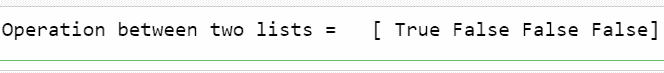
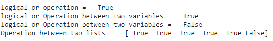

# NumPy 数组–逻辑运算

> 原文:[https://www . geeksforgeeks . org/numpy-array-logic-operations/](https://www.geeksforgeeks.org/numpy-array-logical-operations/)

**逻辑运算**用于寻找两个数组或列表或变量之间的逻辑关系。我们可以在两个数据之间使用 NumPy 执行逻辑运算。以下是我们可以在 Numpy 阵列上执行的各种逻辑操作:

## 和

numpy 模块支持*逻辑 _ 和*运算符。它用于联系两个变量。如果两个变量为 0，则输出为 0，如果两个变量为 1，则输出为 1，如果一个变量为 0，另一个变量为 1，则输出为 0。

**语法:**

> numpy . logic _ and(var1，var2)
> 
> 其中，var1 和 var2 是单个变量或列表/数组。
> 
> **返回类型:**布尔值(真或假)

**例 1:**

这段代码演示了使用*逻辑 _ 和*运算符的布尔运算。

## 蟒蛇 3

```
# importing numpy module
import numpy as np

# list 1 represents an array with boolean values
list1 = [True, False, True, False]

# list 2 represents an array with boolean values
list2 = [True, True, False, True]

# logical operations between boolean values
print('Operation between two lists =  ',
      np.logical_and(list1, list2))
```

**输出:**



**例 2:**

## 蟒蛇 3

```
# importing numpy module
import numpy as np

# list 1 represents an array 
# with integer values
list1 = [1, 2, 3, 4, 5, 0]

# list 2 represents an array 
# with integer values
list2 = [0, 1, 2, 3, 4, 0]

# logical operations between integer values
print('Operation between two lists:', 
      np.logical_and(list1, list2))
```

**输出:**


## 运筹学

NumPy 模块支持*逻辑 _ 或*运算符。它也被用来联系两个变量。如果两个变量为 0，则输出为 0，如果两个变量为 1，则输出为 1，如果一个变量为 0，另一个变量为 1，则输出为 1。

**语法:**

> numpy . logic _ or(var1，var2)
> 
> 其中，var1 和 var2 是单个变量或列表/数组。
> 
> **返回类型:**布尔值(真或假)

**示例:**

## 蟒蛇 3

```
# importing numpy module
import numpy as np

# logical operations between boolean values
print('logical_or operation =  ', 
      np.logical_or(True, False))

a = 2
b = 6
print('logical or Operation between two variables =  ', 
      np.logical_or(a, b))
a = 0
b = 0
print('logical or Operation between two variables =  ', 
      np.logical_or(a, b))

# list 1 represents an array with integer values
list1 = [1, 2, 3, 4, 5, 0]

# list 2 represents an array with integer values
list2 = [0, 1, 2, 3, 4, 0]

# logical operations between integer values
print('Operation between two lists =  ', 
      np.logical_or(list1, list2))
```

**输出:**



## 不

logical_not 操作获取一个值并将其转换为另一个值。如果值为 0，则输出为 1，如果值大于或等于 1，则输出为 0。

**语法:**

> numpy . logic _ not(var1)
> 
> 其中，var1is 是单个变量或列表/数组。
> 
> **返回类型:**布尔值(真或假)

**示例:**

## 蟒蛇 3

```
# importing numpy module
import numpy as np

# logical  not operations for boolean value
print('logical_not operation =  ', 
      np.logical_not(True))

a = 2
b = 6
print('logical_not Operation  =  ', 
      np.logical_not(a))
print('logical_not Operation  =  ', 
      np.logical_not(b))

# list 1 represents an array with integer values
list1 = [1, 2, 3, 4, 5, 0]

# logical operations between integer values
print('Operation in list =  ', 
      np.logical_not(list1))
```