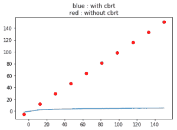

# python 中的 numpy.cbrt()

> 哎哎哎:# t0]https://www . geeksforgeeks . org/num py-cbrt-python/

这个数学函数帮助用户计算 x 的立方根，所有 x 都是数组元素。
**语法:**

```
numpy.cbrt(arr, out = None, ufunc ‘cbrt’) : 
```

**参数:**

```
arr  : *[array_like]* Input array or object
        whose elements, we need to square.

```

**返回:**

```
An array with cube root of x for all x i.e. array elements 

```

**代码#1:工作**

```
# Python program explaining
# cbrt () function

import numpy as np

arr1 = [1, 27000, 64, -1000]
print ("cbrt Value of arr1 : \n", np.cbrt(arr1))

arr2 = [1024 ,-128]
print ("\ncbrt Value of arr2 : ", np.cbrt(arr2))
```

**输出:**

```
cbrt Value of arr1 : 
 [  1\.  30\.   4\. -10.]

cbrt Value of arr2 :  [ 10.0793684  -5.0396842]

```

**代码#2:处理复数**

```
# Python program explaining
# cbrt () function

import numpy as np

a = 4 + 3j
print("cbrt(4 + 3j) : ", np.cbrt(a))

b = 16 + 13j
print("\ncbrt value(16 + 13j) : ", np.cbrt(b))
```

**输出:**

```
<font color="red">TypeError:</font> ufunc 'cbrt' not supported for the input types,
and the inputs could not be safely coerced to any supported
types according to the casting rule ''safe''
```

**代码#3:图形表示**

```
# Python program explaining
# cbrt () function

import numpy as np
import matplotlib.pyplot as plt

a = np.linspace(start = -5, stop = 150,
                num = 10, endpoint = True)

print("Graphical Representation : \n", np.cbrt(a))

plt.title("blue : with cbrt\nred : without cbrt")
plt.plot(a, np.cbrt(a))

plt.scatter(a, a, color = 'red')
plt.show()
```

**输出:**

```
Graphical Representation : 
 [-1.70997595  2.30347441  3.08793243  3.60027433  3.99768384  4.3287262
  4.61565763  4.87076238  5.10162421  5.31329285]
```



**参考文献:**
[https://docs . scipy . org/doc/numpy-1 . 12 . 0/reference/generated/numpy . cbrt . html](https://docs.scipy.org/doc/numpy-1.12.0/reference/generated/numpy.cbrt.html)
。