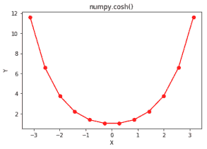

# Python 中的 numpy.cosh()

> 哎哎哎:# t0]https://www . geeksforgeeks . org/num py-cosh-python/

**numpy.cosh()** 是一个数学函数，帮助用户计算所有 x(作为数组元素)的双曲余弦。

相当于 **`1/2 * (np.exp(x) - np.exp(-x))`** 和 **`np.cos(1j*x)`。**

> **语法:** numpy.cosh(x[，out]) = ufunc 'cos')
> **参数:**
> 
> **数组:***【array _ like】*元素以弧度为单位。
> 2pi 弧度= 360 度
> 
> **返回:**所有 x 的双曲余弦为 x 的数组，即数组元素

**代码#1:工作**

```py
# Python3 program explaining
# cosh() function

import numpy as np
import math

in_array = [0, math.pi / 2, np.pi / 3, np.pi]
print ("Input array : \n", in_array)

cosh_Values = np.cosh(in_array)
print ("\ncosine Hyperbolic values : \n", cosh_Values)
```

**输出:**

```py
Input array : 
 [0, 1.5707963267948966, 1.0471975511965976, 3.141592653589793]

cosine Hyperbolic values : 
 [  1\.           2.50917848   1.60028686  11.59195328]

```

**代码#2:图形表示**

```py
# Python program showing Graphical
# representation of cosh() function
import numpy as np
import matplotlib.pyplot as plt

in_array = np.linspace(-np.pi, np.pi, 12)
out_array = np.cosh(in_array)

print("in_array : ", in_array)
print("\nout_array : ", out_array)

# red for numpy.cosh()
plt.plot(in_array, out_array, color = 'red', marker = "o")
plt.title("numpy.cosh()")
plt.xlabel("X")
plt.ylabel("Y")
plt.show()
```

**输出:**

```py
in_array :  [-3.14159265 -2.57039399 -1.99919533 -1.42799666 -0.856798   -0.28559933
  0.28559933  0.856798    1.42799666  1.99919533  2.57039399  3.14159265]

out_array :  [ 11.59195328   6.57373932   3.75927846   2.20506252   1.39006258
   1.04106146   1.04106146   1.39006258   2.20506252   3.75927846
   6.57373932  11.59195328]
```



**参考文献:**[https://docs . scipy . org/doc/numpy-dev/reference/generated/numpy . cosh . html # numpy . cosh](https://docs.scipy.org/doc/numpy-dev/reference/generated/numpy.cosh.html#numpy.cosh)
。