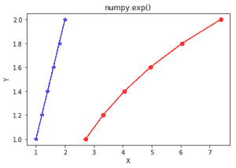

# Python 中的 numpy.exp()

> 哎哎哎:# t0]https://www . geeksforgeeks . org/num py-exp-python/

**numpy.exp(array，out = None，其中= True，casting = 'same_kind '，order = 'K '，dtype = None) :**
这个数学函数帮助用户计算输入数组中所有元素的指数。

**参数:**

```py
array    : [array_like]Input array or object whose elements, we need to test.
out      : [ndarray, optional]Output array with same dimensions as Input array, 
            placed with result.
**kwargs : Allows you to pass keyword variable length of argument to a function. 
           It is used when we want to handle named argument in a function.
where    : [array_like, optional]True value means to calculate the universal 
           functions(ufunc) at that position, False value means to leave the  
           value in the output alone.

```

**返回:**

```py
An array with exponential of all elements of input array. 

```

**代码 1:工作**

```py
# Python program explaining
# exp() function
import numpy as np

in_array = [1, 3, 5]
print ("Input array : ", in_array)

out_array = np.exp(in_array)
print ("Output array : ", out_array)
```

**输出:**

```py
Input array :  [1, 3, 5]
Output array :  [   2.71828183   20.08553692  148.4131591 ]

```

**代码 2:图形表示**

```py
# Python program showing
# Graphical representation of 
# exp() function
import numpy as np
import matplotlib.pyplot as plt

in_array = [1, 1.2, 1.4, 1.6, 1.8, 2]
out_array = np.exp(in_array)

y = [1, 1.2, 1.4, 1.6, 1.8, 2]
plt.plot(in_array, y, color = 'blue', marker = "*")

# red for numpy.exp()
plt.plot(out_array, y, color = 'red', marker = "o")
plt.title("numpy.exp()")
plt.xlabel("X")
plt.ylabel("Y")
plt.show()  
```

**输出:**


**参考文献:**
[https://docs . scipy . org/doc/numpy-1 . 13 . 0/reference/generated/numpy . exp . html](https://docs.scipy.org/doc/numpy-1.13.0/reference/generated/numpy.exp.html)
。