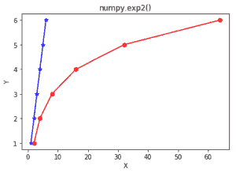

# Python 中的 numpy.exp2()

> 哎哎哎:# t0]https://www . geeksforgeeks . org/num py-exp 2-python/

**numpy.exp2(array，out = None，其中= True，casting = 'same_kind '，order = 'K '，dtype = None) :**
这个数学函数帮助用户计算所有 x 作为数组元素的 2**x。

**参数:**

> **数组:**【array _ like】输入数组或对象，其元素，我们需要测试。
> **出:**【标准排列，可选】输出数组与输入数组尺寸相同，
> 放置有结果。
> ****kwargs :** 允许您将关键字可变长度的参数传递给函数。
> 当我们想要处理函数中的命名参数时使用。
> **其中:**【array _ like，可选】True 值表示计算该位置的通用
> 函数(ufunc)，False 值表示将
> 值单独留在输出中。

**返回:**

```
An array with 2**x(power of 2) for all x i.e. array elements 

```

**代码 1:工作**

```
# Python program explaining
# exp2() function
import numpy as np

in_array = [1, 3, 5, 4]
print ("Input array : \n", in_array)

exp2_values = np.exp2(in_array)
print ("\n2**x values : \n", exp2_values)
```

**输出:**

```
Input array : 
 [1, 3, 5, 4]

2**x values : 
 [  2\.   8\.  32\.  16.]

```

**代码 2:图形表示**

```
# Python program showing
# Graphical representation of 
# exp2() function
import numpy as np
import matplotlib.pyplot as plt

in_array = [1, 2, 3, 4, 5 ,6]
out_array = np.exp2(in_array)

print("out_array : ", out_array)

y = [1, 2, 3, 4, 5 ,6]
plt.plot(in_array, y, color = 'blue', marker = "*")

# red for numpy.exp2()
plt.plot(out_array, y, color = 'red', marker = "o")
plt.title("numpy.exp2()")
plt.xlabel("X")
plt.ylabel("Y")
plt.show()  
```

**输出:**
出 _ 阵:[ 2。4.8.16.32.64.】


**参考文献:**
[https://docs . scipy . org/doc/numpy-1 . 13 . 0/reference/generated/numpy . exp 2 . html](https://docs.scipy.org/doc/numpy-1.13.0/reference/generated/numpy.exp2.html)
。