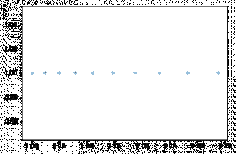

# Python 中的 numpy.geomspace()

> 原文:[https://www.geeksforgeeks.org/numpy-geomspace-in-python/](https://www.geeksforgeeks.org/numpy-geomspace-in-python/)

**numpy.geomspace()** 用于返回在对数标度(几何级数)上均匀分布的数字。
这类似于 [numpy.logspace()](https://www.geeksforgeeks.org/numpy-logspace-python/) 但是直接指定了端点。每个输出样本都是前一个样本的常数倍数。

> **语法:** numpy.geomspace(start，stop，num=50，endpoint=True，dtype=None)
> **参数:**
> **start :** 【标量】序列的起始值。
> **stop :** 【标量】序列的最终值，除非端点为 False。在这种情况下，num + 1 值在 log-space 中的间隔上是隔开的，除了最后一个(长度为 num 的序列)之外，所有值都被返回。
> **编号:**【整数，可选】要生成的样本数。默认值为 50。
> **终点:**【布尔型，可选】如果为真，则 stop 为最后一个样本。否则，不包括在内。默认值为真。
> **数据类型:**【数据类型】输出数组的类型。如果未给出数据类型，则从其他输入参数推断数据类型。
> **返回:**
> **样本:**【ndarray】数量样本，在对数刻度上等距分布。

**代码#1:工作**

## 计算机编程语言

```py
# Python3 Program demonstrate
# numpy.geomspace() function

import numpy as geek

print("B\n", geek.geomspace(2.0, 3.0, num = 5), "\n")

# To evaluate sin() in long range
point = geek.geomspace(1, 2, 10)
print("A\n", geek.sin(point))
```

**输出:**

```py
B
 [ 2\.          2.21336384  2.44948974  2.71080601  3\.        ] 

A
 [ 0.84147098  0.88198596  0.91939085  0.95206619  0.9780296   0.9948976
  0.99986214  0.98969411  0.96079161  0.90929743]
```

**代码# 2:numpy . geomspace()**
的图形表示

## 计算机编程语言

```py
# Graphical Representation of numpy.geomspace()
import numpy as geek
import pylab as p
% matplotlib inline 

# Start = 1
# End = 3

# Samples to generate = 10
x1 = geek.geomspace(1, 3, 10, endpoint = False)
y1 = geek.ones(10)

p.plot(x1, y1, '+')
```

**输出:**

