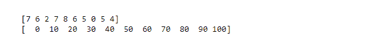
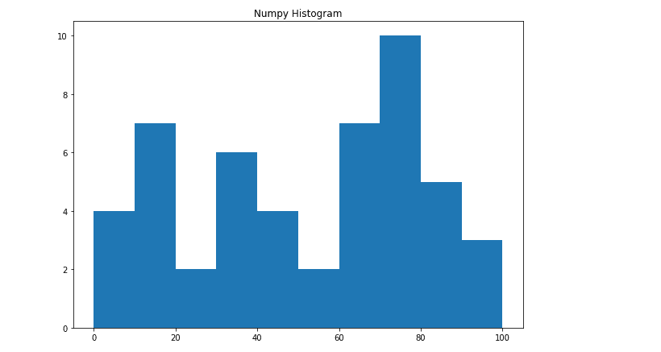

# Python 中的 NumPy .直方图()方法

> 原文:[https://www . geesforgeks . org/numpy-直方图-python 中的方法/](https://www.geeksforgeeks.org/numpy-histogram-method-in-python/)

直方图是可视化数据集频率分布的最佳方式，它将数据集分割成大小相等的小区间，称为面元。Numpy 直方图函数类似于 matplotlib 库的 hist()函数，唯一的区别是 Numpy 直方图给出数据集的数字表示，而 hist()给出数据集的图形表示。

## 创建数值直方图

Numpy 有一个内置的 numpy .直方图()函数，它以图形形式表示数据分布的频率。具有相等水平尺寸的矩形对应于称为箱的类间隔，而可变高度对应于频率。
**语法:**

> 直方图(数据，箱=10，范围=无，赋范=无，权重=无，密度=无)

上述功能的属性如下:

<figure class="table">

| 属性 | 参数 |
| --- | --- |
| 数据 | 要绘制的数组或数组序列 |
| 垃圾箱 | int 或 string 序列定义一个范围内等宽面元数，默认值为 10 |
| 范围 | 可选参数设置箱的下限和上限 |
| 赋范的 | 可选参数与“密度”属性相同，对于不相等的面元宽度给出不正确的结果 |
| 砝码 | 可选参数定义与数据具有相同维度的权重数组 |
| 密度 | 如果假结果包含每个容器中样本数量，如果真结果包含容器中的概率密度函数，则为可选参数 |

</figure>

该函数有两个返回值 **hist** ，给出直方图的值数组，以及 **edge_bin** ，这是一个浮点数据类型数组，包含长度比 hist 多一个的 bin 边。
**例:**

## 蟒蛇 3

```
# Import libraries
import numpy as np

# Creating dataset
a = np.random.randint(100, size =(50))

# Creating histogram
np.histogram(a, bins = [0, 10, 20, 30, 40,
                        50, 60, 70, 80, 90,
                        100])

hist, bins = np.histogram(a, bins = [0, 10,
                                     20, 30,
                                     40, 50,
                                     60, 70,
                                     80, 90,
                                     100])

# printing histogram
print()
print (hist)
print (bins)
print()
```

**输出:**



## 图示

上述直方图的数字表示可以转换成图形形式。Matplotlib py plot 子模块中的 plt()函数以数据集数组和 bin 数组为参数，创建相应数据值的直方图。
**例:**

## 蟒蛇 3

```
# import libraries
from matplotlib import pyplot as plt
import numpy as np 

# Creating dataset
a = np.random.randint(100, size =(50))

# Creating plot
fig = plt.figure(figsize =(10, 7))

plt.hist(a, bins = [0, 10, 20, 30,
                    40, 50, 60, 70,
                    80, 90, 100])

plt.title("Numpy Histogram")

# show plot
plt.show()
```

**输出:**

