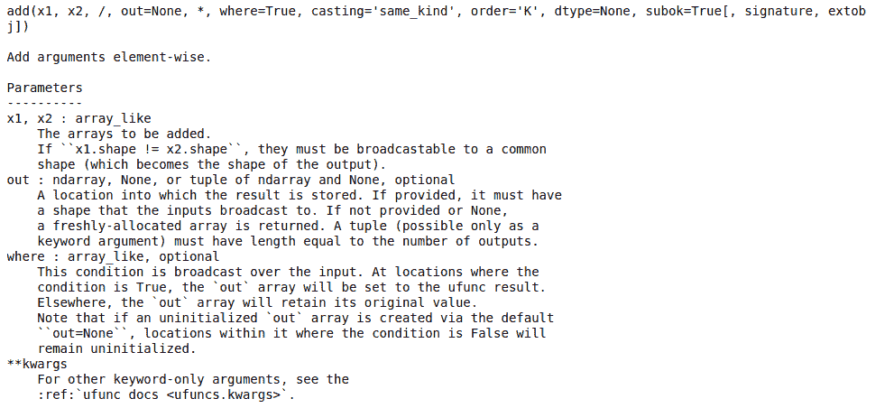
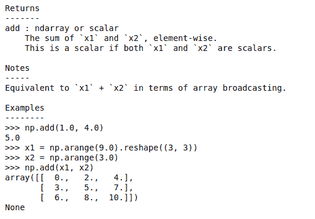

# Python 中的 numpy.info()函数

> 原文:[https://www . geesforgeks . org/numpy-info-function-in-python/](https://www.geeksforgeeks.org/numpy-info-function-in-python/)

在 Numpy 中，借助 **numpy.info()函数，我们可以获得关于函数、类或模块的所有信息，比如参数是什么，返回值的类型是什么。**该函数返回函数、类或模块的帮助信息。

> **语法:**num py . info(num py . info(object = none，maxwidth=76，output= < _io)。文本包装名称=' <标准输出；>【模式=‘w’编码=‘utf-8’>，最高级别=‘num py’)
> 
> **参数:**
> 
> ***objectobject 或 str，可选:*** 这是用于输入获取信息的对象或名称。
> 
> ***最大宽度，可选:*** 为宽度。
> 
> ***输出文件喜欢的对象，可选:*** 对象打开模式。
> 
> ***toplevelstr，可选:*** 在此级别开始搜索。
> 
> **返回:**numpy 中关于 add 函数的所有信息。

**示例:**

## 计算机编程语言

```py
import numpy as np

print(np.info(np.add))
```

**输出:**

 