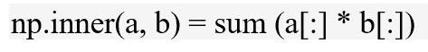

# python 中的 numpy.inner()

> 原文:[https://www.geeksforgeeks.org/numpy-inner-in-python/](https://www.geeksforgeeks.org/numpy-inner-in-python/)

**`numpy.inner(arr1, arr2)` :** 计算两个数组的内积。


```
Parameters : 
arr1, arr2 : array to be evaluated.

Return:  Inner product of the two arrays.
```

**代码#1 :**

```
# Python Program illustrating 
# numpy.inner() method 

import numpy as geek 

# Scalars 
product = geek.inner(5, 4) 
print("inner Product of scalar values : ", product) 

# 1D array 
vector_a = 2 + 3j
vector_b = 4 + 5j

product = geek.inner(vector_a, vector_b) 
print("inner Product : ", product) 
```

**输出:**

```
inner Product of scalar values :  20
inner Product :  (-7+22j)

```

**代码#2 :** 正常矩阵乘法

```
# Python Program illustrating 
# numpy.inner() method 

import numpy as geek 

# 1D array 
vector_a = geek.array([[1, 4], [5, 6]]) 
vector_b = geek.array([[2, 4], [5, 2]]) 

product = geek.inner(vector_a, vector_b) 
print("inner Product : \n", product) 

product = geek.inner(vector_b, vector_a) 
print("\ninner Product : \n", product) 
```

**输出:**

```
inner Product : 
 [[18 13]
 [34 37]]

inner Product : 
 [[18 34]
 [13 37]]

```