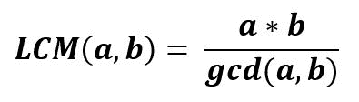

# python 中的 numpy.lcm()

> 哎哎哎:# t0]https://www . geeksforgeeks . org/num py-LCM-in-python/

**`numpy.lcm(arr1, arr2, out = None, where = True, casting = ‘same_kind’, order = ‘K’, dtype = None)` :** 该数学函数帮助用户计算|arr1|和|arr2|元素的 lcm 值。


> **参数:**
> **arr 1/arr 2:**【array _ like】输入数组。
> 
> **返回:**两个或两个以上数字的 LCM。

**代码:**

```py
# Python program illustrating 
# lcm() method 
import numpy as np 

arr1 = [120, 24, 42, 10]
arr2 = [2250, 12, 20, 50]

print ("arr1 : ", arr1)
print ("arr2 : ", arr2)

print ("\nlcm of arr1 and arr2 : ", np.lcm(arr1, arr2))
print ("\nlcm of arr1 and 10   : ", np.lcm(arr1, 10))

```

**输出:**

```py
arr1 : [120, 24, 42, 10]
arr2 : [2250, 12, 20, 50]

lcm of arr1 and arr2 : [9000,   24,  420,   50]

lcm of arr1 and 10   : [120, 120, 210,  10]

```