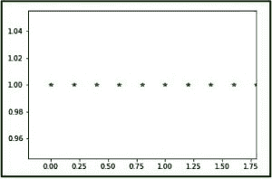
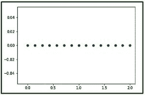

# python 中的 numpy.linspace()

> 哎哎哎:# t0]https://www . geeksforgeeks . org/num py-linspace-python/

**numpy.linspace()** 函数返回间隔均匀的空格数。与[numpy . array()函数](https://www.geeksforgeeks.org/numpy-arange-python/)类似，但它使用样本号代替步长。
**语法:**

```
numpy.linspace(start,
               stop,
               num = 50,
               endpoint = True,
               retstep = False,
               dtype = None)
```

**参数:**

```
-> start  : [optional] start of interval range. By default start = 0
-> stop   : end of interval range
-> restep : If True, return (samples, step). By deflut restep = False
-> num    : [int, optional] No. of samples to generate
-> dtype  : type of output array
```

**返回:**

```
-> ndarray
-> step : [float, optional], if restep = True
```

**代码 1:解释 linspace 函数**

## 计算机编程语言

```
# Python Programming illustrating
# numpy.linspace method

import numpy as geek

# restep set to True
print("B\n", geek.linspace(2.0, 3.0, num=5, retstep=True), "\n")

# To evaluate sin() in long range
x = geek.linspace(0, 2, 10)
print("A\n", geek.sin(x))
```

**输出:**

```
B
 (array([ 2\.  ,  2.25,  2.5 ,  2.75,  3\.  ]), 0.25)

A
 [ 0\.          0.22039774  0.42995636  0.6183698   0.77637192  0.8961922
  0.9719379   0.99988386  0.9786557   0.90929743]
```

**代码 2:使用 matplotlib 模块的 numpy.linspace()的图形表示–pylab**

## 计算机编程语言

```
# Graphical Representation of numpy.linspace()
import numpy as geek
import pylab as p

# Start = 0
# End = 2
# Samples to generate = 10
x1 = geek.linspace(0, 2, 10, endpoint = False)
y1 = geek.ones(10)

p.plot(x1, y1, '*')
p.xlim(-0.2, 1.8)
```

**输出:**



**代码 3:使用 pylab**T2 的 numpy.linspace()的图形表示

## 计算机编程语言

```
# Graphical Representation of numpy.linspace()
import numpy as geek
import pylab as p

# Start = 0
# End = 2
# Samples to generate = 15
x1 = geek.linspace(0, 2, 15, endpoint = True)
y1 = geek.zeros(15)

p.plot(x1, y1, 'o')
p.xlim(-0.2, 2.1)
```

**输出:**



**注意:**
这些 NumPy-Python 程序不会在 onlineID 上运行，所以在你的系统上运行它们来探索它们
。
本文由**莫希特·古普塔 _OMG 供稿😀**。如果你喜欢 GeeksforGeeks 并想投稿，你也可以使用[write.geeksforgeeks.org](https://write.geeksforgeeks.org)写一篇文章或者把你的文章邮寄到 review-team@geeksforgeeks.org。看到你的文章出现在极客博客主页上，帮助其他极客。
如果发现有不正确的地方，或者想分享更多关于上述话题的信息，请写评论。