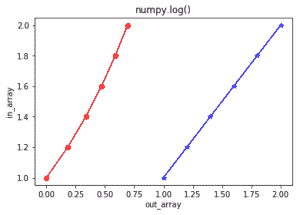

# Python 中的 numpy.log()

> 哎哎哎:# t0]https://www . geeksforgeeks . org/num py-log-python/

**numpy.log()** 是一个数学函数，帮助用户计算 x 的**自然对数，其中 x 属于所有输入数组元素。
自然对数对数是 exp()** 的**倒数，所以**对数(exp(x)) = x** 。自然对数以 e 为底数。**

> **语法:** numpy.log(x[，out] = ufunc 'log1p')
> **参数:**
> 
> **数组:**【array _ like】输入数组或对象。
> **出:**【标准排列，可选】输出数组与输入数组尺寸相同，与结果一起放置。
> 
> **返回:**
> 自然对数值为 x 的数组；其中 x 属于输入数组的所有元素。

**代码#1:工作**

```
# Python program explaining
# log() function
import numpy as np

in_array = [1, 3, 5, 2**8]
print ("Input array : ", in_array)

out_array = np.log(in_array)
print ("Output array : ", out_array)

print("\nnp.log(4**4) : ", np.log(4**4))
print("np.log(2**8) : ", np.log(2**8))
```

**输出:**

```
Input array :  [1, 3, 5, 256]
Output array :  [ 0\.          1.09861229  1.60943791  5.54517744]

np.log(4**4) :  5.54517744448
np.log(2**8) :  5.54517744448

```

**代码#2:图形表示**

```
# Python program showing
# Graphical representation  
# of log() function
import numpy as np
import matplotlib.pyplot as plt

in_array = [1, 1.2, 1.4, 1.6, 1.8, 2]
out_array = np.log(in_array)

print ("out_array : ", out_array)

plt.plot(in_array, in_array, 
         color = 'blue', marker = "*")

# red for numpy.log()
plt.plot(out_array, in_array, 
         color = 'red', marker = "o")

plt.title("numpy.log()")
plt.xlabel("out_array")
plt.ylabel("in_array")
plt.show() 
```

**输出:**

```
out_array :  [ 0\.          0.18232156  0.33647224  0.47000363  0.58778666  0.69314718]

```


**参考文献:**[https://docs . scipy . org/doc/numpy-dev/reference/generated/numpy . log . html # numpy . log](https://docs.scipy.org/doc/numpy-dev/reference/generated/numpy.log.html#numpy.log)
。