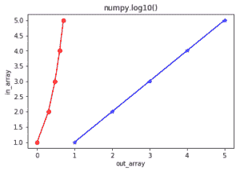

# Python 中的 numpy.log10()

> 哎哎哎:# t0]https://www . geeksforgeeks . org/num py-log 10-python/

**关于:**
**numpy.log10(arr，out = None，*其中= True，casting = 'same_kind '，order = 'K '，dtype = None，ufunc 'log10') :** 这个数学函数帮助用户计算**x 的 10 底对数**其中 x 属于所有输入数组元素。

**参数:**

```
array    : [array_like]Input array or object.
out      : [ndarray, optional]Output array with same dimensions as Input array, 
         placed with result.
**kwargs : allows you to pass keyword variable length of argument to a function. 
         It is used when we want to handle named argument in a function.
where    : [array_like, optional]True value means to calculate the universal 
         functions(ufunc) at that position, False value means to leave the value in the 
         output alone.

```

**返回:**

```
An array with Base-10 logarithmic value of x; 
where x belongs to all elements of input array. 

```

**代码 1:工作**

```
# Python program explaining
# log10() function

import numpy as np

in_array = [1, 3, 5, 10**8]
print ("Input array : ", in_array)

out_array = np.log10(in_array)
print ("Output array : ", out_array)

print("\nnp.log10(4**4) : ", np.log10(100**4))
print("np.log10(2**8) : ", np.log10(10**8))
```

**输出:**

```
Input array :  [1, 3, 5, 100000000]
Output array :  [ 0\.          0.47712125  0.69897     8\.        ]

np.log10(4**4) :  8.0
np.log10(2**8) :  8.0

```

**代码 2:图形表示**

```
# Python program showing
# Graphical representation of 
# log10() function

import numpy as np
import matplotlib.pyplot as plt

in_array = [1, 2, 3, 4, 5]
out_array = np.log10(in_array)

print ("out_array : ", out_array)

plt.plot(in_array, in_array, color = 'blue', marker = "*")

# red for numpy.log10()
plt.plot(out_array, in_array, color = 'red', marker = "o")
plt.title("numpy.log10()")
plt.xlabel("out_array")
plt.ylabel("in_array")
plt.show()  
```

**输出:**

```
out_array :  [ 0\.          0.30103     0.47712125  0.60205999  0.69897   ]
```


**参考文献:**
[https://docs . scipy . org/doc/numpy-1 . 13 . 0/reference/generated/numpy . log 10 . html # numpy . log 10](https://docs.scipy.org/doc/numpy-1.13.0/reference/generated/numpy.log10.html#numpy.log10)
。