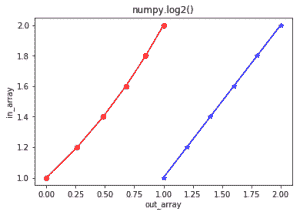

# Python 中的 numpy.log2()

> 哎哎哎:# t0]https://www . geeksforgeeks . org/num py-log 2-python/

**numpy.log2(arr，out = None，*其中= True，casting = 'same_kind '，order = 'K '，dtype = None，ufunc 'log1p') :**
这个数学函数帮助用户计算**x 的 2 底对数**，其中 x 属于所有输入数组元素。

**参数:**

```py
array    : [array_like]Input array or object.
out      : [ndarray, optional]Output array with same dimensions as Input array, 
           placed with result.
**kwargs : Allows you to pass keyword variable length of argument to a function. 
           It is used when we want to handle named argument in a function.
where    : [array_like, optional]True value means to calculate the universal 
           functions(ufunc) at that position, False value means to leave the 
           value in the output alone.

```

**返回:**

```py
An array with Base-2 logarithmic value of x; 
where x belongs to all elements of input array. 

```

**代码 1:工作**

```py
# Python program explaining
# log2() function
import numpy as np

in_array = [1, 3, 5, 2**8]
print ("Input array : ", in_array)

out_array = np.log2(in_array)
print ("Output array : ", out_array)

print("\nnp.log2(4**4) : ", np.log2(4**4))
print("np.log2(2**8) : ", np.log2(2**8))
```

**输出:**

```py
Input array :  [1, 3, 5, 256]
Output array :  [ 0\.          1.5849625   2.32192809  8\.        ]

np.log2(4**4) :  8.0
np.log2(2**8) :  8.0

```

**代码 2:图形表示**

```py
# Python program showing
# Graphical representation of 
# log2() function
import numpy as np
import matplotlib.pyplot as plt

in_array = [1, 1.2, 1.4, 1.6, 1.8, 2]
out_array = np.log2(in_array)

print ("out_array : ", out_array)

plt.plot(in_array, in_array, color = 'blue', marker = "*")

# red for numpy.log2()
plt.plot(out_array, in_array, color = 'red', marker = "o")
plt.title("numpy.log2()")
plt.xlabel("out_array")
plt.ylabel("in_array")
plt.show()  
```

**输出:**

```py
out_array :  [ 0\.          0.26303441  0.48542683  0.67807191  0.84799691  1\.        ]
```


**参考文献:**
[https://docs . scipy . org/doc/numpy-1 . 13 . 0/reference/generated/numpy . exp . html](https://docs.scipy.org/doc/numpy-1.13.0/reference/generated/numpy.exp.html)
。