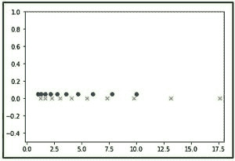

# python 中的 numpy.logspace()

> 哎哎哎:# t0]https://www . geeksforgeeks . org/num py-logs space-python/

**numpy.logspace()** 函数返回对数刻度上均匀间隔的空格数。
**语法:**

```
numpy.logspace(start,
               stop,
               num = 50,
               endpoint = True,
               base = 10.0,
               dtype = None)
```

**参数:**

```
-> start    : [float] start(base ** start) of interval range.
-> stop     : [float] end(base ** stop) of interval range
-> endpoint : [boolean, optional]If True, stop is the last sample. By default, True
-> num      : [int, optional] No. of samples to generate
-> base     : [float, optional] Base of log scale. By default, equals 10.0
-> dtype    : type of output array
```

**返回:**

```
-> ndarray
```

**代码 1:解释日志空间的使用()**

## 计算机编程语言

```
# Python Programming illustrating
# numpy.logspace method

import numpy as geek

# base = 11
print("B\n", geek.logspace(2.0, 3.0, num=5, base = 11))

# base = 10
print("B\n", geek.logspace(2.0, 3.0, num=5))

# base = 10, dtype = int
print("B\n", geek.logspace(2.0, 3.0, num=5, dtype = int))
```

**输出:**

```
B
 [  121\.           220.36039471   401.31159963   730.8527479   1331\.        ]
B
 [  100\.           177.827941     316.22776602   562.34132519  1000\.        ]
B
 [ 100  177  316  562 1000]
```

**代码 2:使用 matplotlib 模块的 numpy.logspace()的图形表示–pylab**

## 计算机编程语言

```
# Graphical Representation of numpy.logspace()
import numpy as geek
import pylab as p

# Start = 0
# End = 2
# Samples to generate = 10
x1 = geek.logspace(0, 1, 10)
y1 = geek.zeros(10)

# Start = 0.1
# End = 1.5
# Samples to generate = 12
x2 = geek.logspace(0.1, 1.5, 12)
y2 = geek.zeros(12)

p.plot(x1, y1+0.05, 'o')
p.xlim(-0.2, 18)
p.ylim(-0.5, 1)
p.plot(x2, y2, 'x')
```

**输出:**



**注意:**
这些 NumPy-Python 程序不会在 onlineID 上运行，所以在你的系统上运行它们来探索它们
**类似的方法:**

*   橙色
*   linspace