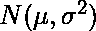
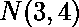

# numpy 矩阵运算| randn()函数

> 原文:[https://www . geeksforgeeks . org/numpy-matrix-operations-randn-function/](https://www.geeksforgeeks.org/numpy-matrix-operations-randn-function/)

**`numpy.matlib.randn()`** 是 numpy 中做矩阵运算的另一个功能。它从均值 0 和方差 1 的单变量“正态”(高斯)分布返回随机值矩阵。

> **语法:**num py . MATLAB . rann(* args)
> 
> **参数:**
> ***参数:**【参数】输出矩阵的形状。如果给定 N 个整数，每个整数指定一个维度的大小。如果作为元组给出，这个元组给出完整的形状。如果有多个参数，并且第一个参数是元组，则忽略其他参数。
> 
> **返回:**由标准正态分布得出的随机值矩阵。

**代码#1 :**

```py
# Python program explaining
# numpy.matlib.randn() function

# importing matrix library from numpy
import numpy as geek
import numpy.matlib

# desired 3 x 4 random output matrix 
out_mat = geek.matlib.randn((3, 4)) 
print ("Output matrix : ", out_mat) 
```

**Output :**

```py
Output matrix :  [[ 0.78620217  0.41624612 -0.28417131  0.1071018 ]
 [ 0.77645105  0.30858858 -1.98901344  1.25977209]
 [ 0.26279443 -0.41026178 -0.60834494  2.82552737]]

```

**代码#2 :**

```py
# Python program explaining
# numpy.matlib.randn() function

# importing numpy and matrix library
import numpy as geek
import numpy.matlib

# desired 1 x 5 random output matrix 
out_mat = geek.matlib.randn(5) 
print ("Output matrix : ", out_mat) 
```

**Output :**

```py
Output matrix :  [[ 0.34973625  0.28159132  0.72581405 -1.17511692  1.96773952]]

```

**代码#3 :**

```py
# Python program explaining
# numpy.matlib.randn() function

# importing numpy and matrix library
import numpy as geek
import numpy.matlib

# more than one argument given
out_mat = geek.matlib.randn((5, 3), 4) 
print ("Output matrix : ", out_mat) 
```

**Output :**

```py
Output matrix :  [[ 0.56784957  0.82980325  1.16683558]
 [-1.53444326 -0.27743273  0.65819067]
 [ 0.99654573 -1.20399432 -0.25603147]
 [ 1.74931585  0.58413453  1.67820029]
 [-1.25643231  0.21610229  0.21694595]]

```

**注:**对于来自的随机样本，我们可以使用`sigma * geek.matlib.randn(...) + mu` 。
例如，制作一个 3×3 的矩阵，其中的样本取自:

**代码#4 :**

```py
# Python program explaining
# numpy.matlib.randn() function

# importing numpy and matrix library
import numpy as geek
import numpy.matlib

# So, here mu = 3, sigma = 2
out_mat = 2 * geek.matlib.randn((3, 3)) + 3
print ("Output matrix : ", out_mat) 
```

**Output :**

```py
Output matrix :  [[ 4.04967121  0.26982021  2.3503067 ]
 [ 5.57757131  2.40051874 -0.84588539]
 [ 7.43715651  3.84004412  1.40514615]]

```