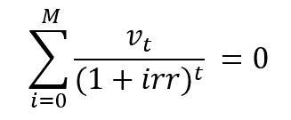

# python 中的 numpy . mirr()

> 原文:[https://www.geeksforgeeks.org/numpy-mirr-in-python/](https://www.geeksforgeeks.org/numpy-mirr-in-python/)

**数值，财务率，再投资率:**该财务函数帮助用户计算修正的内部收益率值，即**修正的内部收益率**即。“平均”定期复合收益率
内部收益率等于–



> **参数:**
> **值:**【阵列式】输入每个时间段的现金流。净“存款”为负数，净“取款”为正数
> **finance_rate :** 现金金额支付的利息。
> **再投资 _ 利率:**收到的现金金额利息。
> **返回:**修改了周期输入值即内部收益率。考虑利息价值。

**代码:**

## 蟒蛇 3

```py
# Python program explaining
# mirr() function

import numpy as np
'''
Question :

    Investment = 500
    Withdrawls at regular interval : 50, 31, 3, 11
'''

Solution = np.mirr([-500, 50, 31, 3, 11], .34, .21)

print("Solution - Modified Internal Rate of Return : ", Solution)
```

**输出:**

```py
Solution - Modified Internal Rate of Return :  -0.26165615714437973
```