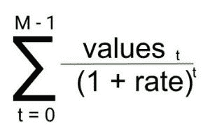

# Python 中的 numpy.npv()

> 哎哎哎:# t0]https://www . geeksforgeeks . org/num py-NPV-python/

**NPV(比率，价值):**该财务函数帮助用户计算现金流系列的 **NPV(净现值)**。

**参数:**

```
rate  : [scalar] Rate of discount 
value : [array_like, shape(M,)] value of 
        cash flows time series. The (fixed) time interval 
        between cash flow “events” must be the same as that
        for given rate is given. By convention, investments
        or “deposits” are -ve, income or “withdrawals” are +ve

```

**返回:**

```
present value as per given parameters.

```

**正在求解的方程:**


**代码 1:工作**

```
## Python program explaining pv() function
import numpy as np

#            rate            values     
a =  np.npv(0.281,[-100, 19, 49, 58, 200])
print("Net Present Value(npv) : ", a)
```

**输出:**

```
Net Present Value(npv) :  46.5579792365

```

**参考文献:**
[https://docs . scipy . org/doc/numpy-1 . 13 . 0/reference/generated/numpy . NPV . html](https://docs.scipy.org/doc/numpy-1.13.0/reference/generated/numpy.npv.html)
。