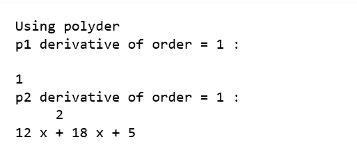
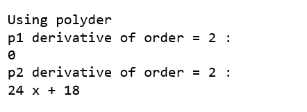

# python 中的 numpy.polyder()

> 原文:[https://www.geeksforgeeks.org/numpy-polyder-in-python/](https://www.geeksforgeeks.org/numpy-polyder-in-python/)

**numpy.polyder()** 方法计算指定阶数的多项式的导数。

> **语法:** numpy.polyder(p，m)
> **参数:**
> **p:**【array _ like 或 poly1D】多项式系数按幂的递减顺序给出。如果第二个参数(根)设置为真，那么数组值就是多项式方程的根。
> **例如:** poly1d(3，2，6) = 3x <sup>2</sup> + 2x + 6
> 
> **m:**【int，可选】微分顺序。
> 
> **返回:**多项式的导数。

**代码:**解释 polyder()的 Python 代码

```py
# Python code explaining 
# numpy.polyder()

# importing libraries
import numpy as np
import pandas as pd

# Constructing polynomial 
p1 = np.poly1d([1, 2]) 
p2 = np.poly1d([4, 9, 5, 4]) 

print ("P1 : ", p1) 
print ("\n p2 : \n", p2) 
```


```py

# Solve for x = 2 
print ("\n\np1 at x = 2 : ", p1(2)) 
print ("p2 at x = 2 : ", p2(2)) 
```


```py
a = np.polyder(p1, 1)
b = np.polyder(p2, 1)
print ("\n\nUsing polyder")
print ("p1 derivative of order = 1 : \n", a) 
print ("p2 derivative of order = 1 : \n", b) 
```



```py
a = np.polyder(p1, 2)
b = np.polyder(p2, 2)
print ("\n\nUsing polyder")
print ("p1 derivative of order = 2 : ", a) 
print ("p2 derivative of order = 2 : ", b)
```

