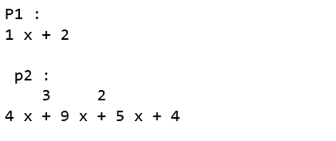
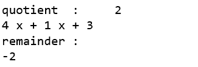
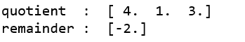

# Python 中的 numpy.polydiv()

> 原文:[https://www.geeksforgeeks.org/numpy-polydiv-in-python/](https://www.geeksforgeeks.org/numpy-polydiv-in-python/)

**numpy . poldiv()**方法计算两个多项式的除法，并返回多项式除法的商和余数。

> **语法:** numpy.polydiv(p1，p2)
> **参数:**
> **P1:**【array _ like 或 poly1D】被除数多项式的系数。
> **p2:**【array _ like 或 poly1D】除数多项式的系数。
> 
> **返回:**
> **q:**【ndarray】商的系数。
> **r:**【n 数组】余数系数。

**代码:解释聚二夫()**的 Python 代码

```
# Python code explaining 
# numpy.polydiv()

# importing libraries
import numpy as np
import pandas as pd

# Constructing polynomial 
p1 = np.poly1d([1, 2]) 
p2 = np.poly1d([4, 9, 5, 4]) 

print ("P1 : ", p1) 
print ("\n p2 : \n", p2) 
```



```
quotient, remainder = np.polydiv(p2, p1)

print("\n\nquotient  : ", quotient)
print("remainder : ", remainder)
print ("\n")
```



```
# Defining ndarray
x = np.array([1, 2])
y = np.array([4, 9, 5, 4])

quotient, remainder = np.polydiv(y, x)

print("quotient  : ", quotient)
print("remainder : ", remainder)
```

