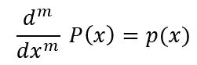

# python 中的 numpy.polyint()

> 原文:[https://www.geeksforgeeks.org/numpy-polyint-in-python/](https://www.geeksforgeeks.org/numpy-polyint-in-python/)

**`numpy.polyint(p, m)` :** 计算指定阶数的多项式的反导数。

多项式“P”的 m 个反导数“P”满足


> **参数:**
> **p:**【array _ like 或 poly1D】多项式系数按幂次递减顺序给出。如果第二个参数(根)设置为真，那么数组值就是多项式方程的根。比如 poly1d(3，2，6)= 3x<sup>2</sup>+2x+6
> **m:**【int，可选】反导数的顺序。默认值为 1。
> 
> **返回:**多项式的反导数。

**代码#1:**

```py
# Python code explaining  
# numpy.polyint() 

# importing libraries 
import numpy as np 

# Constructing polynomial  
p1 = np.poly1d([1, 2])  
p2 = np.poly1d([4, 9, 5, 4])  

print ("P1 : ", p1)  
print ("\n p2 : \n", p2) 

# Solve for x = 2  
print ("\n\np1 at x = 2 : ", p1(2))  
print ("p2 at x = 2 : ", p2(2))  

a = np.polyint(p1, 1) 
b = np.polyint(p2, 1) 
print ("\n\nUsing polyint") 
print ("p1 anti-derivative of order = 1 : \n", a) 
print ("p2 anti-derivative of order = 1 : \n", b) 

a = np.polyint(p1, 2) 
b = np.polyint(p2, 2) 
print ("\n\nUsing polyint") 
print ("p1 anti-derivative of order = 2 : \n", a) 
print ("p2 anti-derivative of order = 2 : \n", b) 
```

**输出:**

```py
P1 :   
1 x + 2

 p2 : 
    3     2
4 x + 9 x + 5 x + 4

p1 at x = 2 :  4
p2 at x = 2 :  82

Using polyint
p1 anti-derivative of order = 1 : 
      2
0.5 x + 2 x
p2 anti-derivative of order = 1 : 
    4     3       2
1 x + 3 x + 2.5 x + 4 x

```

**代码#2:**

```py
# Python code explaining  
# numpy.polyint() 

# importing libraries 
import numpy as np 

# Constructing polynomial  
p1 = np.poly1d([1, 2])  
p2 = np.poly1d([4, 9, 5, 4])  

a = np.polyint(p1, 2) 
b = np.polyint(p2, 2) 

print ("\n\nUsing polyint") 
print ("p1 anti-derivative of order = 2 : \n", a) 
print ("p2 anti-derivative of order = 2 : \n", b) 
```

**输出:**

```py
Using polyint
p1 anti-derivative of order = 2 : 
         3     2
0.1667 x + 1 x
p2 anti-derivative of order = 2 : 
      5        4          3     2
0.2 x + 0.75 x + 0.8333 x + 2 x
```