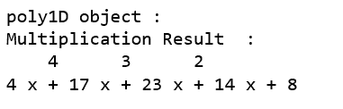

# python 中的 numpy . polymul()

> 哎哎哎:# t0]https://www . geeksforgeeks . org/num py-poly-in-python/

**numpy.polymul()** 方法计算两个多项式的乘积，并返回两个输入多项式“p1”和“p2”相乘得到的多项式。

> **语法:** numpy.polymul(p1，p2)
> **参数:**
> **P1:**【array _ like 或 poly1D】输入多项式 1。
> **p2:**【array _ like 或 poly1D】输入多项式 2。
> 
> **返回:**输入相乘得到的多项式。

如果任一输入是`poly1D` 对象，那么输出也是一个 poly1D 对象，否则，多项式系数的 1D 数组按次数递减。

**代码:解释 polymul()** 的 Python 代码

```py
# Python code explaining 
# numpy.polymul()

# importing libraries
import numpy as np
import pandas as pd

# Constructing polynomial 
p1 = np.poly1d([1, 2]) 
p2 = np.poly1d([4, 9, 5, 4]) 

print ("P1 : ", p1) 
print ("\n p2 : \n", p2) 
```


```py
mul = np.polymul(p2, p1)

print("\n\npoly1D object : ")
print("Multiplication Result  : \n", mul)
```



```py
# Defining ndarray
x = np.array([1, 2])
y = np.array([4, 9, 5, 4])
mul = np.polymul(y, x)

print("\n1D array : ")
print("Multiplication Result  : ", mul)
```

