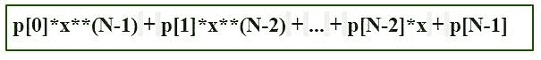
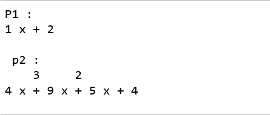
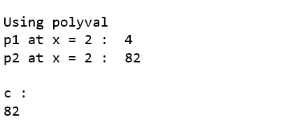

# python 中的 numpy.polyval()

> 哎哎哎:# t0]https://www . geeksforgeeks . org/num py-poly val-in-python/

**numpy.polyval(p，x)** 方法评估特定值下的多项式。

如果**‘N’**是多项式‘p’的长度，则该函数返回值


> `**Parameters :**`
> **p:**【array _ like 或 poly1D】多项式系数按幂的递减顺序给出。如果第二个参数(根)设置为真，那么数组值就是多项式方程的根。
> **例如:** poly1d(3，2，6) = 3x <sup>2</sup> + 2x + 6
> 
> **x:**【array _ like 或 poly1D】一个数，一个数的数组，用于计算‘p’。
> 
> `**Return:**`多项式的评估值。

**代码:**解释 polyval()的 Python 代码

```py
# Python code explaining 
# numpy.polyval()

# importing libraries
import numpy as np
import pandas as pd

# Constructing polynomial 
p1 = np.poly1d([1, 2]) 
p2 = np.poly1d([4, 9, 5, 4]) 

print ("P1 : ", p1) 
print ("\n p2 : \n", p2) 
```



```py
# Solve for x = 2 
print ("\n\np1 at x = 2 : ", p1(2)) 
print ("p2 at x = 2 : ", p2(2)) 
```


```py
a = np.polyval([1, 2], 2)
b = np.polyval([4, 9, 5, 4], 2)

print ("\n\nUsing polyval")
print ("p1 at x = 2 : ", a) 
print ("p2 at x = 2 : ", b) 

c = np.polyval(np.poly1d([4, 9, 5, 4]), np.poly1d(2))
print ("\nc : ", c)
```

