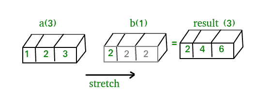
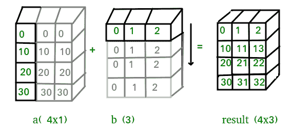
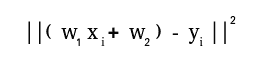
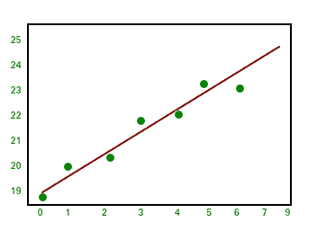

# Python 中的 NumPy |第 2 集(高级)

> 原文:[https://www.geeksforgeeks.org/numpy-python-set-2-advanced/](https://www.geeksforgeeks.org/numpy-python-set-2-advanced/)

[Python 中的 NumPy |第 1 集(简介)](https://www.geeksforgeeks.org/numpy-in-python-set-1-introduction/)

本文讨论了 NumPy 中一些更高级的方法。

1.  **Stacking:** Several arrays can be stacked together along different axes.
    *   **np.vstack:** 沿垂直轴堆叠阵列。
    *   **np.hstack:** 沿水平轴堆叠阵列。
    *   **np.column_stack:** 将一维数组作为列堆叠成二维数组。
    *   **np.concatenate:** 沿指定轴堆叠数组(轴作为参数传递)。

    ```
    import numpy as np

    a = np.array([[1, 2],
                  [3, 4]])

    b = np.array([[5, 6],
                  [7, 8]])

    # vertical stacking
    print("Vertical stacking:\n", np.vstack((a, b)))

    # horizontal stacking
    print("\nHorizontal stacking:\n", np.hstack((a, b)))

    c = [5, 6]

    # stacking columns
    print("\nColumn stacking:\n", np.column_stack((a, c)))

    # concatenation method 
    print("\nConcatenating to 2nd axis:\n", np.concatenate((a, b), 1))
    ```

    输出:

    ```
    Vertical stacking:
     [[1 2]
     [3 4]
     [5 6]
     [7 8]]

    Horizontal stacking:
     [[1 2 5 6]
     [3 4 7 8]]

    Column stacking:
     [[1 2 5]
     [3 4 6]]

    Concatenating to 2nd axis:
     [[1 2 5 6]
     [3 4 7 8]]
    ```

2.  **Splitting:**For splitting, we have these functions:
    *   **np.hsplit:** 沿横轴拆分数组。
    *   **np.vsplit:** 沿纵轴拆分数组。
    *   **np.array_split:** 沿指定轴拆分数组。

    ```
    import numpy as np

    a = np.array([[1, 3, 5, 7, 9, 11],
                  [2, 4, 6, 8, 10, 12]])

    # horizontal splitting
    print("Splitting along horizontal axis into 2 parts:\n", np.hsplit(a, 2))

    # vertical splitting
    print("\nSplitting along vertical axis into 2 parts:\n", np.vsplit(a, 2))
    ```

    输出:

    ```
    Splitting along horizontal axis into 2 parts:
     [array([[1, 3, 5],
           [2, 4, 6]]), array([[ 7,  9, 11],
           [ 8, 10, 12]])]

    Splitting along vertical axis into 2 parts:
     [array([[ 1,  3,  5,  7,  9, 11]]), array([[ 2,  4,  6,  8, 10, 12]])]
    ```

3.  **Broadcasting:** The term broadcasting describes how NumPy treats arrays with different shapes during arithmetic operations. Subject to certain constraints, the smaller array is “broadcast” across the larger array so that they have compatible shapes.

    广播提供了一种向量化数组操作的方法，这样循环就可以用 C 语言而不是 Python 语言进行。它可以做到这一点，而不会产生不必要的数据副本，并且通常可以实现高效的算法。还有一些情况下，广播是一个坏主意，因为它会导致内存使用效率低下，从而降低计算速度。

    NumPy 操作通常逐元素完成，这需要两个数组具有完全相同的形状。当数组的形状满足某些约束时，Numpy 的广播规则放松了这种约束。

    **广播规则:**为了广播，操作中两个数组的尾轴大小必须相同，或者其中一个必须是**一个**。

    让我们看一些例子:

    ```
    A(2-D array): 4 x 3
    B(1-D array):     3
    Result      : 4 x 3 
    ```

    ```
    A(4-D array): 7 x 1 x 6 x 1
    B(3-D array):     3 x 1 x 5
    Result      : 7 x 3 x 6 x 5 
    ```

    但这是不匹配的:

    ```
    A: 4 x 3
    B:     4 
    ```

    最简单的广播示例发生在数组和标量值在操作中组合的时候。
    考虑下面给出的例子:

    ```
    import numpy as np

    a = np.array([1.0, 2.0, 3.0])

    # Example 1
    b = 2.0
    print(a * b)

    # Example 2
    c = [2.0, 2.0, 2.0]
    print(a * c)
    ```

    输出:

    ```
    [ 2\.  4\.  6.]
    [ 2\.  4\.  6.]
    ```

    我们可以想象标量 b 在算术运算过程中被拉伸成一个与 a 形状相同的数组，b 中的新元素，如上图所示，只是原始标量的副本。虽然，拉伸类比只是概念上的。
    Numpy 足够聪明，可以使用原始标量值，而无需实际制作副本，因此广播操作尽可能节省内存并提高计算效率。因为示例 1 在乘法过程中移动的内存更少，(b 是标量，不是数组)，所以它比示例 2 使用 Windows 2000 上的标准 numpy 和一百万个元素数组快 10%左右！
    下图让概念更加清晰:

    

    在上面的示例中，标量 b 被拉伸成一个与 a 形状相同的数组，因此形状对于逐个元素的乘法是兼容的。

    现在，让我们看一个例子，两个数组都被拉伸了。

    ```
    import numpy as np

    a = np.array([0.0, 10.0, 20.0, 30.0])
    b = np.array([0.0, 1.0, 2.0])

    print(a[:, np.newaxis] + b)
    ```

    输出:

    ```
    [[  0\.   1\.   2.]
     [ 10\.  11\.  12.]
     [ 20\.  21\.  22.]
     [ 30\.  31\.  32.]]

    ```

    
    在某些情况下，广播会拉伸两个阵列，以形成比任何一个初始阵列都大的输出阵列。

4.  **Working with datetime:** Numpy has core array data types which natively support datetime functionality. The data type is called “datetime64”, so named because “datetime” is already taken by the datetime library included in Python.
    Consider the example below for some examples:

    ```
    import numpy as np

    # creating a date
    today = np.datetime64('2017-02-12')
    print("Date is:", today)
    print("Year is:", np.datetime64(today, 'Y'))

    # creating array of dates in a month
    dates = np.arange('2017-02', '2017-03', dtype='datetime64[D]')
    print("\nDates of February, 2017:\n", dates)
    print("Today is February:", today in dates)

    # arithmetic operation on dates
    dur = np.datetime64('2017-05-22') - np.datetime64('2016-05-22')
    print("\nNo. of days:", dur)
    print("No. of weeks:", np.timedelta64(dur, 'W'))

    # sorting dates
    a = np.array(['2017-02-12', '2016-10-13', '2019-05-22'], dtype='datetime64')
    print("\nDates in sorted order:", np.sort(a))
    ```

    输出:

    ```
    Date is: 2017-02-12
    Year is: 2017

    Dates of February, 2017:
     ['2017-02-01' '2017-02-02' '2017-02-03' '2017-02-04' '2017-02-05'
     '2017-02-06' '2017-02-07' '2017-02-08' '2017-02-09' '2017-02-10'
     '2017-02-11' '2017-02-12' '2017-02-13' '2017-02-14' '2017-02-15'
     '2017-02-16' '2017-02-17' '2017-02-18' '2017-02-19' '2017-02-20'
     '2017-02-21' '2017-02-22' '2017-02-23' '2017-02-24' '2017-02-25'
     '2017-02-26' '2017-02-27' '2017-02-28']
    Today is February: True

    No. of days: 365 days
    No. of weeks: 52 weeks

    Dates in sorted order: ['2016-10-13' '2017-02-12' '2019-05-22']
    ```

5.  **Linear algebra in NumPy:** The Linear Algebra module of NumPy offers various methods to apply linear algebra on any numpy array.
    You can find:
    *   秩、行列式、迹等。数组的。
    *   矩阵的特征值
    *   矩阵和向量乘积(点、内、外等。乘积)、矩阵幂运算
    *   求解线性或张量方程等等！

    考虑下面的例子，它解释了我们如何使用 NumPy 来做一些矩阵运算。

    ```
    import numpy as np

    A = np.array([[6, 1, 1],
                  [4, -2, 5],
                  [2, 8, 7]])

    print("Rank of A:", np.linalg.matrix_rank(A))

    print("\nTrace of A:", np.trace(A))

    print("\nDeterminant of A:", np.linalg.det(A))

    print("\nInverse of A:\n", np.linalg.inv(A))

    print("\nMatrix A raised to power 3:\n", np.linalg.matrix_power(A, 3))
    ```

    输出:

    ```
    Rank of A: 3

    Trace of A: 11

    Determinant of A: -306.0

    Inverse of A:
     [[ 0.17647059 -0.00326797 -0.02287582]
     [ 0.05882353 -0.13071895  0.08496732]
     [-0.11764706  0.1503268   0.05228758]]

    Matrix A raised to power 3:
     [[336 162 228]
     [406 162 469]
     [698 702 905]]
    ```

    让我们假设我们想要求解这个线性方程组:

    ```
    x + 2*y = 8
    3*x + 4*y = 18 
    ```

    这个问题可以用 **linalg.solve** 方法解决，如下例所示:

    ```
    import numpy as np

    # coefficients
    a = np.array([[1, 2], [3, 4]])
    # constants
    b = np.array([8, 18])

    print("Solution of linear equations:", np.linalg.solve(a, b))
    ```

    输出:

    ```
    Solution of linear equations: [ 2\.  3.]
    ```

    最后，我们看到一个例子，说明如何使用最小二乘法进行线性回归。

    线性回归线的形式是 w1 *x + w* 2 = y，并且它是最小化从每个数据点到直线的距离的平方和的线。因此，给定 n 对数据(xi，yi)，我们要寻找的参数是 w1 和 w2，它们可以将误差降至最低:

    

    让我们看看下面的例子:

    ```
    import numpy as np
    import matplotlib.pyplot as plt

    # x co-ordinates
    x = np.arange(0, 9)
    A = np.array([x, np.ones(9)])

    # linearly generated sequence
    y = [19, 20, 20.5, 21.5, 22, 23, 23, 25.5, 24]
    # obtaining the parameters of regression line
    w = np.linalg.lstsq(A.T, y)[0] 

    # plotting the line
    line = w[0]*x + w[1] # regression line
    plt.plot(x, line, 'r-')
    plt.plot(x, y, 'o')
    plt.show()
    ```

    输出:

    

所以，这就引出了本系列 NumPy 教程的结论。

NumPy 是一个广泛使用的通用库，它是许多其他计算库的核心，如 scipy、scikit-learn、tensorflow、matplotlib、opencv 等。对 NumPy 有一个基本的了解有助于高效地处理其他更高级别的库！

**参考文献:**

*   [http://scipy.github.io/old-wiki/pages/EricsBroadcastingDoc](http://scipy.github.io/old-wiki/pages/EricsBroadcastingDoc)
*   [https://docs . scipy . org/doc/numpy/reference/arrays . datetime . html # arrays-dtypes-date units](https://docs.scipy.org/doc/numpy/reference/arrays.datetime.html#arrays-dtypes-dateunits)
*   [https://docs . scipy . org/doc/numpy/reference/routines . linalg . html](https://docs.scipy.org/doc/numpy/reference/routines.linalg.html)
*   [http://glowngpython . blogspot . in/2012/03/linear-revolution-with-numpy . html](http://glowingpython.blogspot.in/2012/03/linear-regression-with-numpy.html)