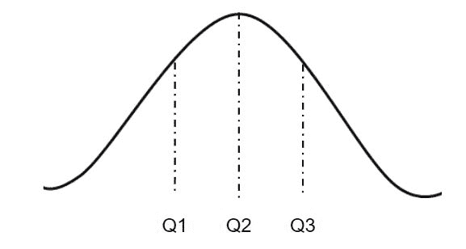

# Python 中的 numpy.quantile()

> 原文:[https://www.geeksforgeeks.org/numpy-quantile-in-python/](https://www.geeksforgeeks.org/numpy-quantile-in-python/)

**`numpy.quantile(arr, q, axis = None)` :** 沿指定轴计算给定数据(数组元素)的第 q <sup>个</sup>分位数。

当处理正态分布时，分位数在统计学中起着非常重要的作用。

在上图中，`Q2`是正态分布数据的`median`。`Q3 - Q2`表示给定数据集的**分位数区间**。

> **参数:**
> **arr:**【array _ like】输入数组。
> **q :** 分位数值。
> **轴:**【int 或 int 的元组】轴，我们要沿着该轴计算分位数值。否则，它将考虑将 arr 展平(在所有轴上工作)。axis = 0 表示沿列工作，axis = 1 表示沿行工作。
> **out:**【n 数组，可选】我们要放置结果的不同数组。数组必须具有与预期输出相同的维度。
> 
> **结果:**数组(如果轴为无，则为标量值)或沿指定轴具有分位数值的数组的 qth 分位数。

**代码#1:**

```py
# Python Program illustrating 
# numpy.quantile() method 
import numpy as np

# 1D array 
arr = [20, 2, 7, 1, 34]

print("arr : ", arr) 
print("Q2 quantile of arr : ", np.quantile(arr, .50))
print("Q1 quantile of arr : ", np.quantile(arr, .25))
print("Q3 quantile of arr : ", np.quantile(arr, .75))
print("100th quantile of arr : ", np.quantile(arr, .1)) 

```

**输出:**

```py
arr : [20, 2, 7, 1, 34]
Q2 quantile of arr : 7.0)
Q1 quantile of arr : 2.0)
Q3 quantile of arr : 20.0)
100th quantile of arr : 1.4)

```

**代码#2:**

```py
# Python Program illustrating 
# numpy.quantile() method 
import numpy as np

# 2D array 
arr = [[14, 17, 12, 33, 44],  
       [15, 6, 27, 8, 19], 
       [23, 2, 54, 1, 4, ]] 
print("\narr : \n", arr) 

# quantile of the flattened array 
print("\n50th quantile of arr, axis = None : ", np.quantile(arr, .50)) 
print("0th quantile of arr, axis = None : ", np.quantile(arr, 0)) 

# quantile along the axis = 0 
print("\n50th quantile of arr, axis = 0 : ", np.quantile(arr, .25, axis = 0)) 
print("0th quantile of arr, axis = 0 : ", np.quantile(arr, 0, axis = 0)) 

# quantile along the axis = 1 
print("\n50th quantile of arr, axis = 1 : ", np.quantile(arr, .50, axis = 1)) 
print("0th quantile of arr, axis = 1 : ", np.quantile(arr, 0, axis = 1)) 

print("\n0th quantile of arr, axis = 1 : \n", 
   np.quantile(arr, .50, axis = 1, keepdims = True))
print("\n0th quantile of arr, axis = 1 : \n", 
   np.quantile(arr, 0, axis = 1, keepdims = True))
```

**输出:**

```py
arr : 
[[14, 17, 12, 33, 44], [15, 6, 27, 8, 19], [23, 2, 54, 1, 4]]

50th quantile of arr, axis = None : 15.0
0th quantile of arr, axis = None : 1)

50th quantile of arr, axis = 0 : [14.5  4\.  19.5  4.5 11.5]
0th quantile of arr, axis = 0 : [14  2 12  1  4]

50th quantile of arr, axis = 1 : [17\. 15\.  4.]
0th quantile of arr, axis = 1 : [12  6  1]

0th quantile of arr, axis = 1 : 
[[17.]
[15.]
[ 4.]]

0th quantile of arr, axis = 1 : 
[[12]
[ 6]
[ 1]]

```