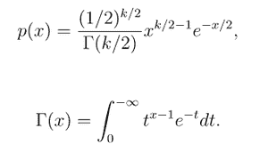
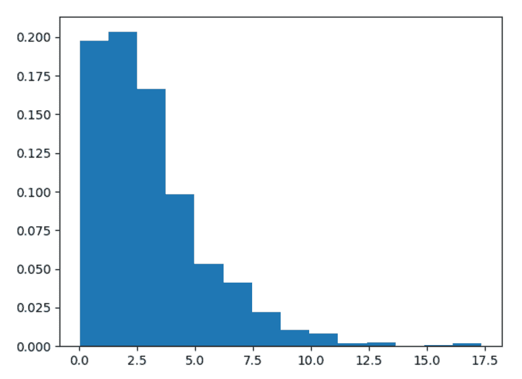
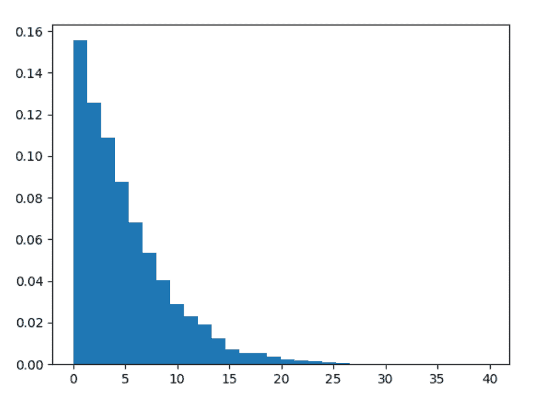

# Python 中的 numpy.random.chisquare()

> 原文:[https://www . geesforgeks . org/numpy-random-chisquare-in-python/](https://www.geeksforgeeks.org/numpy-random-chisquare-in-python/)

借助 **chisquare()** 方法，利用该方法可以得到卡方分布。我们主要可以在假设检验中使用这种分布。



卡方分布

> **语法:** numpy.random.chisquare(df，size=None)
> 
> **参数:**
> 
> **1)df–**自由度数，必须为> 0。
> 
> **2)大小–**标量阵列的输出形状。
> 
> **返回:**返回标量 numpy 数组。

**示例#1 :**

在这个例子中我们可以看到，通过使用 **chisquare()** 方法，我们能够得到卡方分布，并通过使用这个方法返回标量 numpy 数组。

## 蟒蛇 3

```
# import chisquare
import numpy as np
import matplotlib.pyplot as plt

# Using chisquare() method
gfg = np.random.chisquare(3, 1000)

count, bins, ignored = plt.hist(gfg, 14, density = True)
plt.show()
```

**输出:**

> 

**例 2 :**

## 蟒蛇 3

```
# import chisquare
import numpy as np
import matplotlib.pyplot as plt

# Using chisquare() method
gfg = np.random.chisquare(5, 10000)
gfg1 = np.random.chisquare(gfg, 10000)

count, bins, ignored = plt.hist(gfg1, 30, density = True)
plt.show()
```

**输出:**

> 