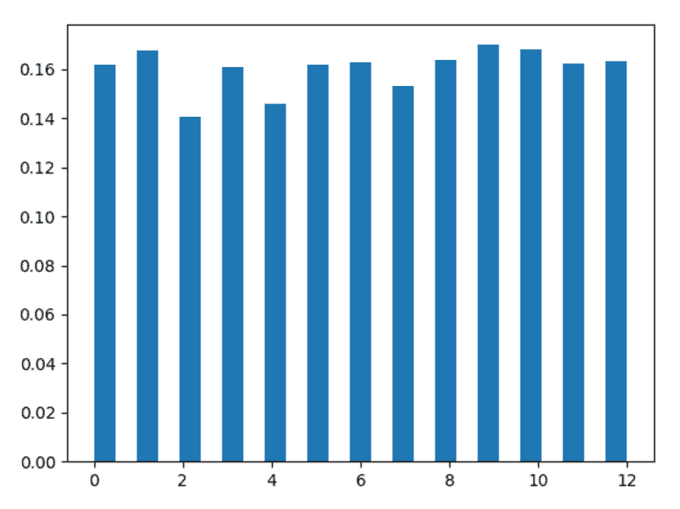
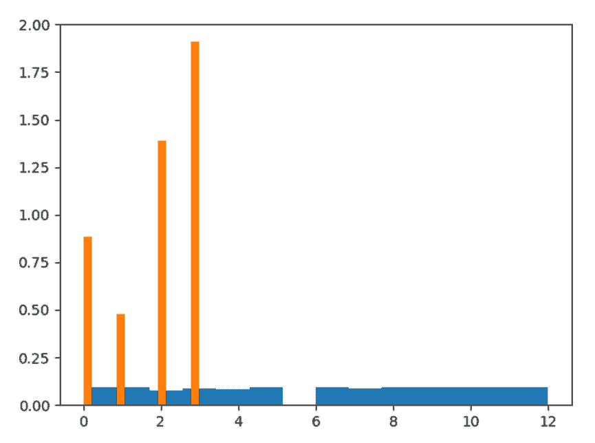

# Python 中的 numpy.random.choice()

> 原文:[https://www . geesforgeks . org/numpy-python 中的随机选择/](https://www.geeksforgeeks.org/numpy-random-choice-in-python/)

借助 **choice()** 方法，可以得到一维数组的随机样本，并返回 numpy 数组的随机样本。

> **语法:** numpy.random.choice(a，size=None，replace=True，p=None)
> 
> **参数:**
> 
> **1)具有随机样本的一维 numpy 阵列。**
> 
> **2)大小–**numpy 阵列随机样本的输出形状。
> 
> **3)更换–**样品是否更换。
> 
> **4)p–**a 中每个样本的概率
> 
> **输出:**返回随机样本的 numpy 数组。

**示例#1 :**

在这个例子中我们可以看到，通过使用 **choice()** 方法，我们能够得到 numpy 数组的随机样本，使用这个方法可以生成均匀或非均匀的样本。

## 蟒蛇 3

```
# import choice
import numpy as np
import matplotlib.pyplot as plt

# Using choice() method
gfg = np.random.choice(13, 5000)

count, bins, ignored = plt.hist(gfg, 25, density = True)
plt.show()
```

**输出:**

> 

**例 2 :**

## 蟒蛇 3

```
# import choice
import numpy as np
import matplotlib.pyplot as plt

# Using choice() method
gfg = np.random.choice(5, 1000, p =[0.2, 0.1, 0.3, 0.4, 0])

count, bins, ignored = plt.hist(gfg, 14, density = True)
plt.show()
```

**输出:**

> 