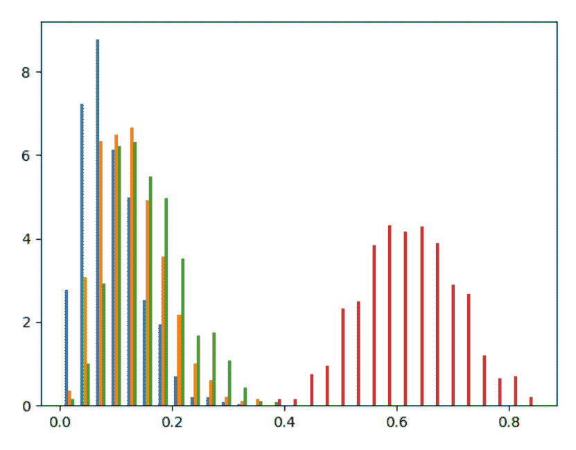
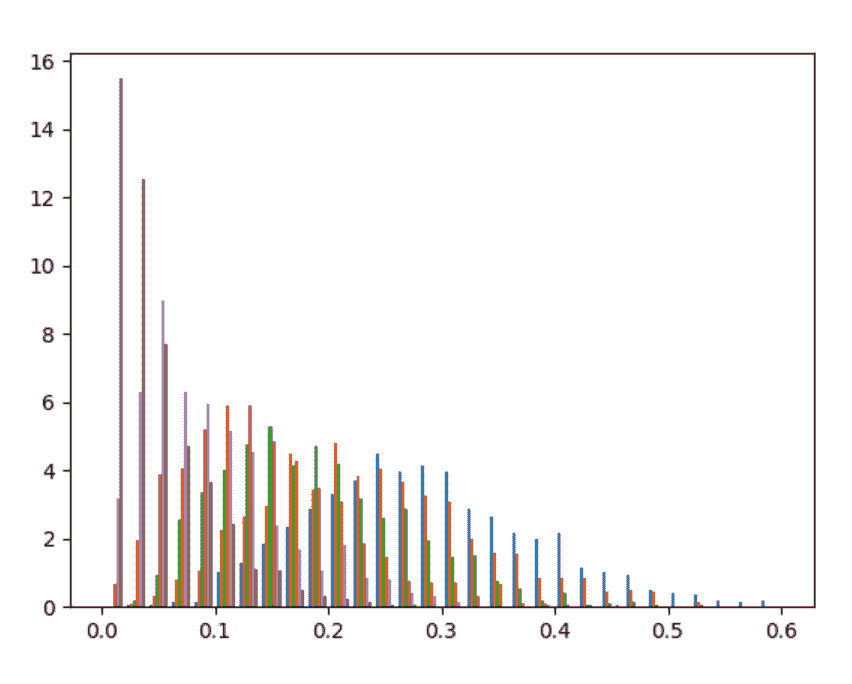

# Python 中的 numpy.random.dirichlet()

> 原文:[https://www . geesforgeks . org/numpy-random-Dirichlet-in-python/](https://www.geeksforgeeks.org/numpy-random-dirichlet-in-python/)

借助**狄利克雷()**方法，我们可以从狄利克雷分布中得到随机样本，并利用这种方法返回一些随机样本的 numpy 数组。

> **语法:**numpy . random . Dirichlet(alpha，size=None)
> 
> **参数:**
> 
> **1)α–**样本数。
> 
> **2)numpy 阵列的大小–**输出形状。
> 
> **返回:**返回随机样本数组。

**示例#1 :**

在这个例子中我们可以看到，通过使用 **random.dirichlet()** 方法，我们能够获得 dirichlet 分布的随机样本，并返回具有参数中定义的大小的 numpy 数组。

## 蟒蛇 3

```
# import dirichlet
import numpy as np
import matplotlib.pyplot as plt

# Using dirichlet() method
gfg = np.random.dirichlet((3, 4, 5, 19), size = 1000)

count, bins, ignored = plt.hist(gfg, 30, density = True)
plt.show()
```

**输出:**

> 

**例 2 :**

## 蟒蛇 3

```
# import dirichlet
import numpy as np
import matplotlib.pyplot as plt

# Using dirichlet() method
gfg = np.random.dirichlet((6, 5, 4, 3, 2, 1), 1000)

count, bins, ignored = plt.hist(gfg, 30, density = True)
plt.show()
```

**输出:**

> 