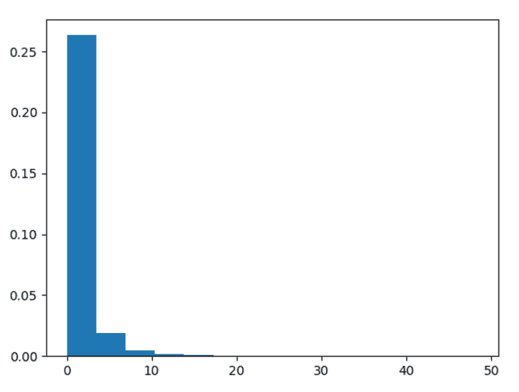

# Python 中的 numpy.random.f()

> 原文:[https://www.geeksforgeeks.org/numpy-random-f-in-python/](https://www.geeksforgeeks.org/numpy-random-f-in-python/)

借助 **numpy.random.f()** 方法，可以得到 F 分布的随机样本，并利用该方法返回 numpy 阵列的随机样本。

> **语法:** numpy.random.f(dfnum，dfden，size=None)
> 
> **返回:**将随机样本作为 numpy 数组返回。

**示例#1 :**

在这个例子中我们可以看到，通过使用 **numpy.random.f()** 方法，我们能够得到 F 分布的随机样本，并使用这个方法返回随机样本。

## 蟒蛇 3

```
# import numpy and f
import numpy as np
import matplotlib.pyplot as plt

# Using f() method
gfg = np.random.f(0.98, 15.43, 1000)

count, bins, ignored = plt.hist(gfg, 30, density = True)
plt.show()
```

**输出:**

> 

**例 2 :**

## 蟒蛇 3

```
# import numpy and f
import numpy as np
import matplotlib.pyplot as plt

# Using f() method
gfg = np.random.f(14.56, 31.45, 30000)
gfg1 = np.random.f(gfg, 10.45, 30000)

count, bins, ignored = plt.hist(gfg1, 14, density = True)
plt.show()
```

**输出:**

> 