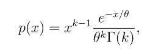
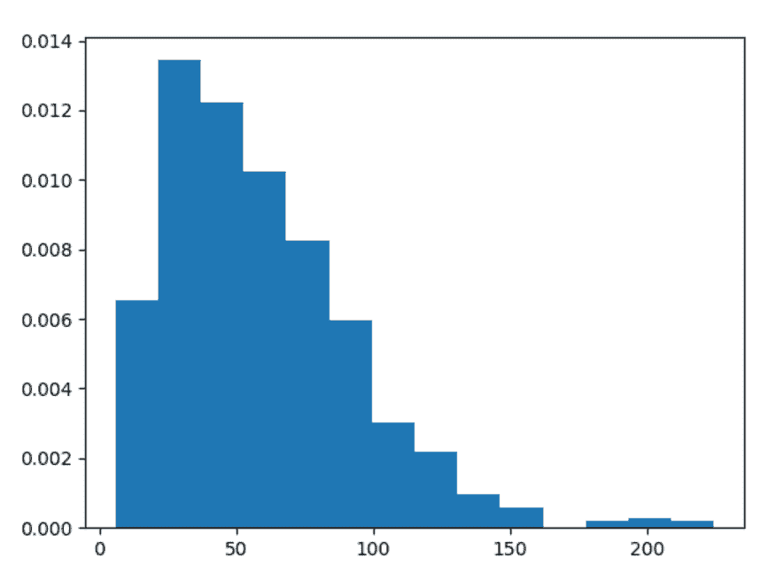
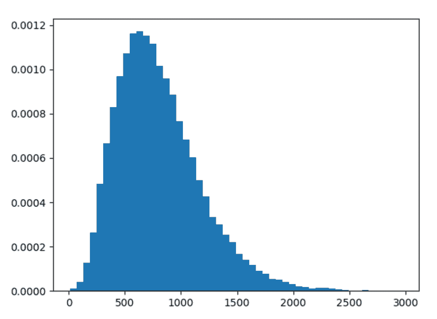

# Python 中的 numpy.random.gamma()

> 原文:[https://www.geeksforgeeks.org/numpy-random-gamma-in-python/](https://www.geeksforgeeks.org/numpy-random-gamma-in-python/)

借助 **numpy.random.gamma()** 方法，可以得到 gamma 分布的随机样本，并利用该方法返回 numpy 阵列的随机样本。



γ分布

> **语法:** numpy.random.gamma(形状，比例=1.0，大小=无)
> 
> **返回:**返回 numpy 数组的随机样本。

**示例#1 :**

在这个例子中，我们可以看到，通过使用 **numpy.random.gamma()** 方法，我们能够从 gamma 分布中获得随机样本，并使用该方法返回随机样本。

## 蟒蛇 3

```
# import numpy and gamma
import numpy as np
import matplotlib.pyplot as plt

# Using gamma() method
gfg = np.random.gamma(3, 20, 1000)

count, bins, ignored = plt.hist(gfg, 14, density = True)
plt.show()
```

**输出:**

> 

**例 2 :**

## 蟒蛇 3

```
# import numpy and gamma
import numpy as np
import matplotlib.pyplot as plt

# Using gamma() method
gfg = np.random.gamma(4.98, 12, 40000)
gfg1 = np.random.gamma(gfg, 13.46, 40000)

count, bins, ignored = plt.hist(gfg1, 50, density = True)
plt.show()
```

**输出:**

> 