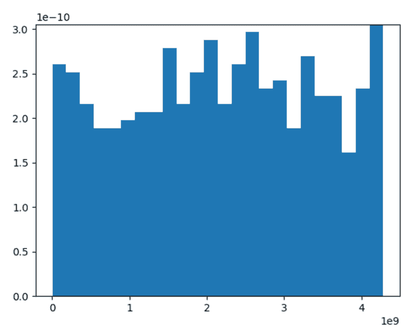

# Python 中的 numpy.random.get_state()

> 原文:[https://www . geesforgeks . org/numpy-random-get _ state-in-python/](https://www.geeksforgeeks.org/numpy-random-get_state-in-python/)

借助 **numpy.random.get_state()** 方法，我们可以得到一个生成器的内部状态，并使用该方法返回元组。

> **语法:** numpy.random.get_state()
> 
> **Return :** 返回具有{tuple(str，ndarray 为 624 个单位，int，int，float)，dict}的元组

**示例#1 :**

在这个例子中我们可以看到，通过使用 **numpy.random.get_state()** 方法，我们能够获得具有生成器内部状态的元组，并通过使用这个方法返回元组。

## 蟒蛇 3

```
# import numpy and get_state
import numpy as np

# Using get_state() method
gfg = np.random.get_state()[0]

print(gfg)
```

**输出:**

> 19937 年中期

**例 2 :**

## 蟒蛇 3

```
# import numpy and get_state
import numpy as np
import matplotlib.pyplot as plt

# Using get_state() method
gfg = np.random.get_state()[1]

count, bins, ignored = plt.hist(gfg, 24, density = True)
plt.show()
```

**输出:**

> 