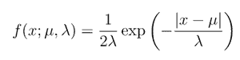
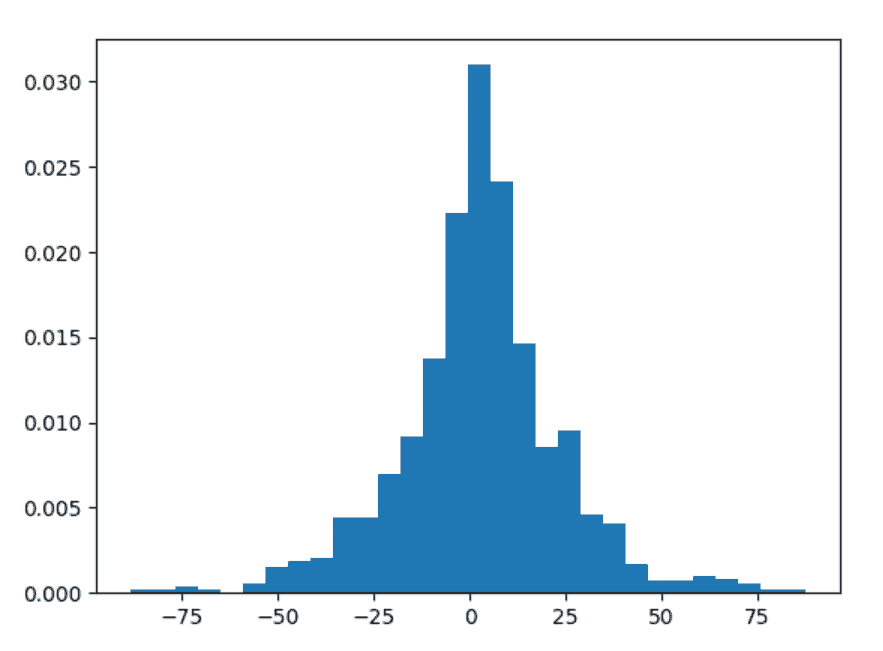
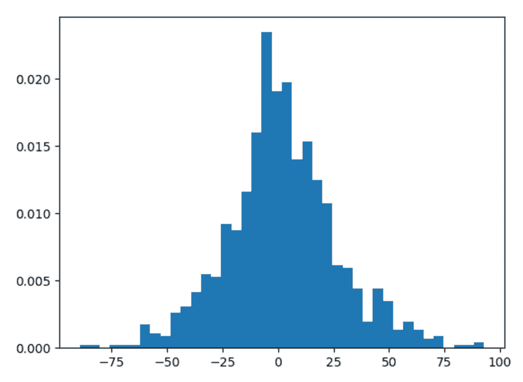

# Python 中的 numpy.random .拉普拉斯()

> 原文:[https://www . geesforgeks . org/numpy-random-la place-in-python/](https://www.geeksforgeeks.org/numpy-random-laplace-in-python/)

借助 **numpy.random .拉普拉斯()**方法，我们可以得到具有特定均值和尺度值的拉普拉斯或双指数分布的随机样本，并利用该方法返回随机样本。



拉普拉斯分布

> **语法:** numpy.random .拉普拉斯(loc=0.0，scale=1.0，size=None)
> 
> **返回:**将随机样本作为 numpy 数组返回。

**示例#1 :**

在这个例子中，我们可以看到，通过使用 **numpy.random .拉普拉斯()**方法，我们能够获得拉普拉斯或双指数分布的随机样本，并使用该方法返回随机样本。

## 蟒蛇 3

```
# import numpy 
import numpy as np
import matplotlib.pyplot as plt

# Using numpy.random.laplace() method
gfg = np.random.laplace(1.45, 15, 1000)

count, bins, ignored = plt.hist(gfg, 30, density = True)
plt.show()
```

**输出:**

> 

**例 2 :**

## 蟒蛇 3

```
# import numpy 
import numpy as np
import matplotlib.pyplot as plt

# Using numpy.random.laplace() method
gfg = np.random.laplace(0.5, 12.45, 1000)
gfg1 = np.random.laplace(gfg, 12.45, 1000)

count, bins, ignored = plt.hist(gfg1, 40, density = True)
plt.show()
```

**输出:**

> 