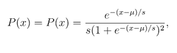
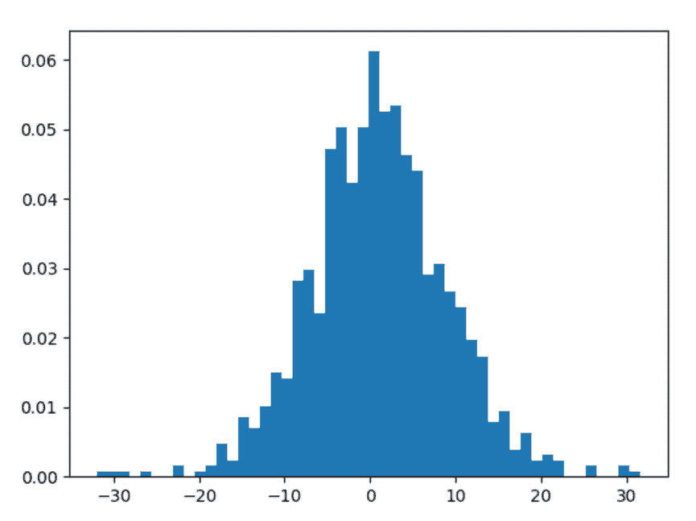
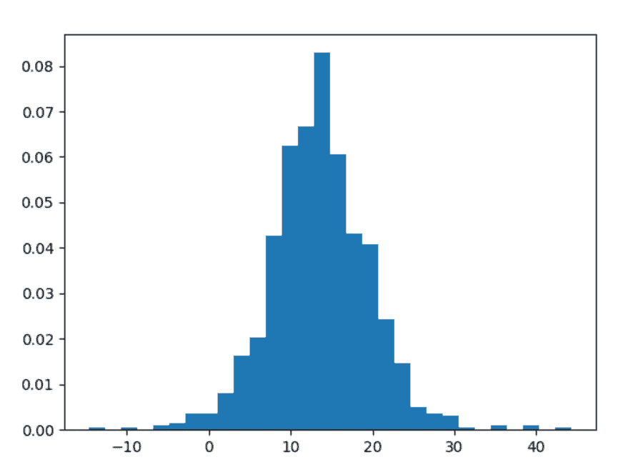

# Python 中的 numpy.random.logistic()

> 原文:[https://www . geesforgeks . org/numpy-random-logistics-in-python/](https://www.geeksforgeeks.org/numpy-random-logistic-in-python/)

借助 **numpy.random.logistic()** 方法，我们可以得到 logistic 分布的随机样本，并利用该方法返回随机样本。



配送

> **语法:**numpy . random . logistic(loc = 0.0，scale=1.0，size=None)
> 
> **返回:**将随机样本作为 numpy 数组返回。

**示例#1 :**

在这个例子中我们可以看到，通过使用 **numpy.random.logistic()** 方法，我们能够得到 logistic 分布的随机样本，并通过使用这个方法返回随机样本。

## 蟒蛇 3

```py
# import numpy
import numpy as np
import matplotlib.pyplot as plt

# Using numpy.random.logistic() method
gfg1 = np.random.logistic(1.23, 3.14, 1000)
gfg2 = np.random.logistic(gfg1, 3.14, 1000)

count, bins, ignored = plt.hist(gfg2, 50, density = True)
plt.show()
```

**输出:**

> 

**例 2 :**

## 蟒蛇 3

```py
# import numpy
import numpy as np
import matplotlib.pyplot as plt

# Using numpy.random.logistic() method
gfg = np.random.logistic(13.31, 3.31, 1000)

count, bins, ignored = plt.hist(gfg, 30, density = True)
plt.show()
```

**输出:**

> 