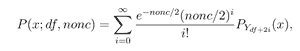
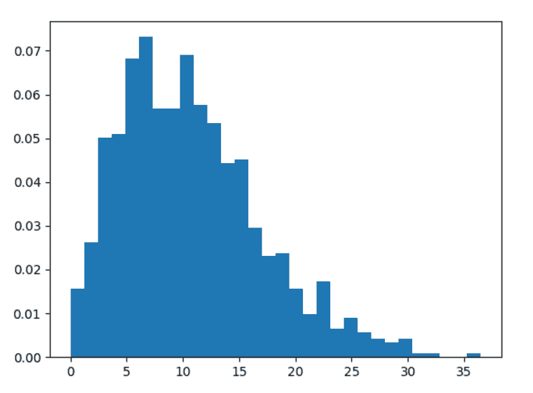
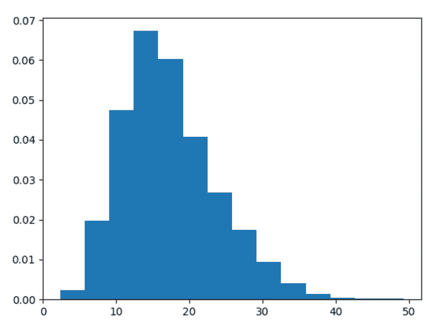

# Python 中的 numpy . random . noncentral _ chisquare()

> 原文:[https://www . geesforgeks . org/numpy-random-noncentral _ chisquare-in-python/](https://www.geeksforgeeks.org/numpy-random-noncentral_chisquare-in-python/)

借助**numpy . random . noncentral _ chisquare()**方法，可以得到非中心卡方分布的随机样本，并利用该方法返回其随机样本。



非中心卡方分布

> **语法:**numpy . random . noncentral _ chisquare(df，nonc，size=None)
> 
> **返回:**将随机样本作为 numpy 数组返回。

**示例#1 :**

在这个例子中我们可以看到，通过使用**numpy . random . noncentral _ chisquare()**方法，我们能够获得非中心卡方分布的随机样本，并使用该方法返回随机样本。

## 蟒蛇 3

```py
# import numpy
import numpy as np
import matplotlib.pyplot as plt

# Using noncentral_chisquare() method
gfg = np.random.noncentral_chisquare(1.21, 9.89, 1000)

count, bins, ignored = plt.hist(gfg, 30, density = True)
plt.show()
```

**输出:**

> 

**例 2 :**

## 蟒蛇 3

```py
# import numpy
import numpy as np
import matplotlib.pyplot as plt

# Using noncentral_chisquare() method
gfg = np.random.noncentral_chisquare(14.05, 3.24, 3000)

count, bins, ignored = plt.hist(gfg, 14, density = True)
plt.show()
```

**输出:**

> 