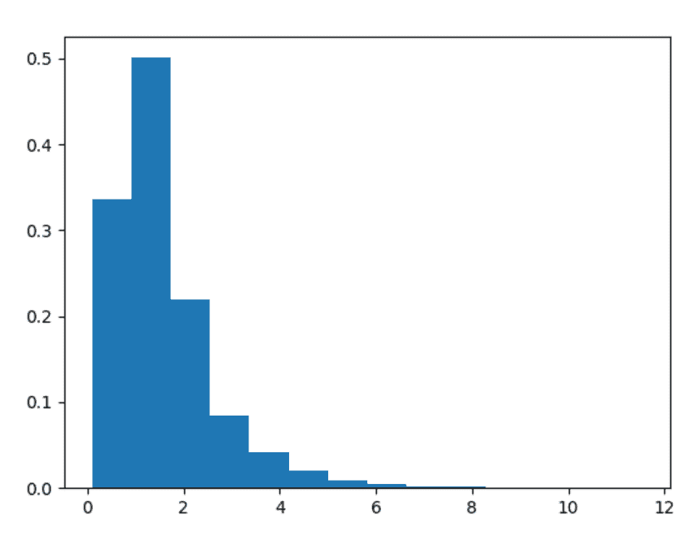

# Python 中的 numpy . random . noncentral _ f()

> 原文:[https://www . geesforgeks . org/numpy-random-noncentral _ f-in-python/](https://www.geeksforgeeks.org/numpy-random-noncentral_f-in-python/)

在 numpy 的帮助下。 **random.noncentral_f()** 方法，我们可以从非中心 F 分布中获取随机样本，并利用该方法返回随机样本。

> **语法:**numpy . random . noncentral _ f(dfnum，dfden，nonc，size=None)
> 
> **返回:**将随机样本作为 numpy 数组返回。

**示例#1 :**

在这个例子中我们可以看到，通过使用**numpy . random . noncentral _ F()**方法，我们能够通过使用该方法从非中心 F 分布中获得随机样本。

## 蟒蛇 3

```py
# import numpy
import numpy as np
import matplotlib.pyplot as plt

# Using noncentral_f() method
gfg = np.random.noncentral_f(1.24, 21, 3, 1000)

count, bins, ignored = plt.hist(gfg, 50, density = True)
plt.show()
```

**输出:**

> 

**例 2 :**

## 蟒蛇 3

```py
# import numpy
import numpy as np
import matplotlib.pyplot as plt

# Using noncentral_f() method
gfg = np.random.noncentral_f(10.23, 12.13, 3, 10000)

count, bins, ignored = plt.hist(gfg, 14, density = True)
plt.show()
```

**输出:**

> 